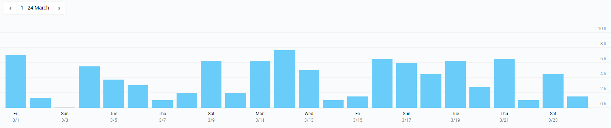

# Milestone 10

|       |                    |
| ----- | ------------------ |
| From  | 2019-03-01         |
| Until | 2019-03-24         |
| Hours | 92.75              |
| Asked | 4637.5 DAI @ 50/hr |
| Given | 4637.5             |

## References

Tx: <https://etherscan.io/tx/0x43124873c953f4bf8579ddafb7601c25c2b78d64a6d3b99c1ccbf915e4e3d16e>

## Description

Work in progress:

- [#230 [WIP] Simpler API using events and promises](https://github.com/aragon/aragon.js/pull/230)

Opened these PRs:

- [#406 Add ipfs view & ipfs propagate](https://github.com/aragon/aragon-cli/pull/406)
- [#403 Add source-maps for better stack traces](https://github.com/aragon/aragon-cli/pull/403)
- [#108 Fix tutorial.md](https://github.com/aragon/hack/pull/108)
- [#109 Document apm info + apm packages](https://github.com/aragon/hack/pull/109)
- [#390 Port e2e tests to node](https://github.com/aragon/aragon-cli/pull/390)

Tested/reviewed these PRs:

- [#38 Use @aragon/api-react](https://github.com/aragon/aragon-react-boilerplate/pull/38)
- [#259 Add @aragon/api-react](https://github.com/aragon/aragon.js/pull/259)
- [#414 Update kits to templates](https://github.com/aragon/aragon-cli/pull/414)
- [#41 Merge react-kit](https://github.com/aragon/aragon-react-boilerplate/pull/41)
- [#119 Change kits to templates](https://github.com/aragon/hack/pull/119)
- [#410 aragonCLI: upgrade installed Aragon client version](https://github.com/aragon/aragon-cli/pull/410)
- [#399 Don't slice content hash in dao apps](https://github.com/aragon/aragon-cli/pull/399)
- [#1 Add .ipfsignore and @babel/polyfill dependency](https://github.com/aragon/your-first-aragon-app/pull/1)
- [#99 Update aragonCLI documentation](https://github.com/aragon/hack/pull/99)
- [#386 Yargs12](https://github.com/aragon/aragon-cli/pull/386)

Opened/discussed these issues:

- [#413 Customize network id of the devchain](https://github.com/aragon/aragon-cli/issues/413)
- [#42 Folder structure](https://github.com/aragon/aragon-react-boilerplate/issues/42)
- [#380 Avoid installing IPFS binary if user has already installed IPFS](https://github.com/aragon/aragon-cli/issues/380)
- [#384 new command: aragon ipfs propagate &lt;hash&gt;](https://github.com/aragon/aragon-cli/issues/384)
- [#411 Node debugger](https://github.com/aragon/aragon-cli/issues/411)
- [#412 Code owners](https://github.com/aragon/aragon-cli/issues/412)
- [#407 Support permissions with parameters](https://github.com/aragon/aragon-cli/issues/407)
- [#408 Support CLI extensions](https://github.com/aragon/aragon-cli/issues/408)
- [#409 Iterate on `ipfs propagate`](https://github.com/aragon/aragon-cli/issues/409)
- [#265 @aragon/wrapper using events and promises](https://github.com/aragon/aragon.js/issues/265)
- [#405 Tests to measure performance](https://github.com/aragon/aragon-cli/issues/405)
- [#264 API: migrate to promise-based returns for single-emission responses](https://github.com/aragon/aragon.js/issues/264)
- [#39 Remove Publishing section from readme](https://github.com/aragon/aragon-react-boilerplate/issues/39)
- [#391 Unable to use "your first aragon app"](https://github.com/aragon/aragon-cli/issues/391)
- [#401 Document release steps](https://github.com/aragon/aragon-cli/issues/401)
- [#110 Generate aragonOS docs](https://github.com/aragon/hack/issues/110)
- [#396 Iterate on the `apm packages` command](https://github.com/aragon/aragon-cli/issues/396)
- [#397 Iterate on the `apm info` command](https://github.com/aragon/aragon-cli/issues/397)
- [#387 Token Manager revert on initialize](https://github.com/aragon/aragon-cli/issues/387)
- [#388 apm publish results in: Transaction would not succeed](https://github.com/aragon/aragon-cli/issues/388)
- [#398 Better environment names for the boilerplates or the default ones](https://github.com/aragon/aragon-cli/issues/398)
- [#400 Add issue templates](https://github.com/aragon/aragon-cli/issues/400)
- [#402 Automate documentation sync](https://github.com/aragon/aragon-cli/issues/402)
- [#392 Import the aragen package in this repo](https://github.com/aragon/aragon-cli/issues/392)
- [#376 Migrate tests to node](https://github.com/aragon/aragon-cli/issues/376)
- [#123 Migrate to rxjs 6](https://github.com/aragon/aragon.js/pull/123)

I have also spent a couple of days working on our Nest proposal:

- [#148 Aragon Nest Proposal: aragonCLI](https://github.com/aragon/nest/issues/148)
