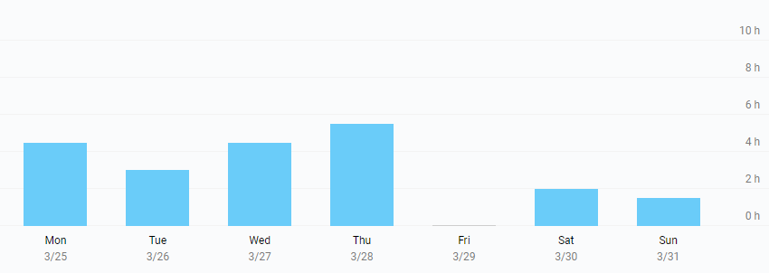

# Milestone 11

|       |                  |
| ----- | ---------------- |
| From  | 2019-03-25       |
| Until | 2019-03-31       |
| Hours | 21               |
| Asked | 1050 DAI @ 50/hr |
| Given | 1050 DAI         |

## References

Tx: <https://etherscan.io/tx/0x43124873c953f4bf8579ddafb7601c25c2b78d64a6d3b99c1ccbf915e4e3d16e>

## Description

Work in progress:

- [#32 Convert scripts to node to support windows](https://github.com/aragon/aragen/pull/32)
- [#65 Aragon 0.6.4 doesn't load](https://github.com/aragon/aragon-desktop/issues/65)

Opened these PRs:

- [#418 Update client version](https://github.com/aragon/aragon-cli/pull/418)
- [#124 Pull docs from the CLI repo](https://github.com/aragon/hack/pull/124)
- [#420 Import docs from hack](https://github.com/aragon/aragon-cli/pull/420)
- [#44 Fix api-react setup](https://github.com/aragon/aragon-react-boilerplate/pull/44)

Tested/reviewed these PRs:

- [#46 Add test sample for counter app](https://github.com/aragon/aragon-react-boilerplate/pull/46)

Opened/discussed these issues:

- [#755 Convert ganache-cli.sh to node](https://github.com/aragon/aragon-apps/issues/755)
- [#416 Integrate with CLI extensions](https://github.com/aragon/aragon-cli/issues/416)
