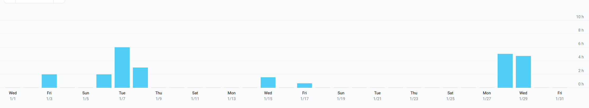

# Milestone 30

|       |                  |
| ----- | ---------------- |
| From  | 2020-01-01       |
| Until | 2020-01-31       |
| Hours | 25               |
| Asked | 1250 DAI @ 50/hr |
| Given | -                |

## References

Tx:

## Description

Started work on (WIP):

- [#560 Integrate with cloud-based IPFS pinning servers (e.g. Pinata)](https://github.com/aragon/aragon-cli/issues/560)
- [#1082 Rinkeby APM DAO can't be inspected](https://github.com/aragon/aragon-cli/issues/1082)

Opened these PRs:

- [#41 Wrap 2019](https://github.com/AragonMesh/team/pull/41)
- [#1039 Add typescript & typedoc](https://github.com/aragon/aragon-cli/pull/1039)
- [#1289 Fix getMerkleDAG](https://github.com/aragon/aragon-cli/pull/1289)
  
Reviewed these PRs:

Discussed these issues:

- [#1083 Test mechanism is creating too many node processes](https://github.com/aragon/aragon-cli/issues/1083)
- [#1290 Maintenance label missing](https://github.com/aragon/aragon-cli/issues/1290)
- [#1213 ipfs propagate don't querry whole merkle graph](https://github.com/aragon/aragon-cli/issues/1213)
- [#1114 Ipfs propagate hangs forever fetching the gateways](https://github.com/aragon/aragon-cli/issues/1114)
- [#1155 Review IPFS propagation technique](https://github.com/aragon/aragon-cli/issues/1155)
- [#1144 copyfiles is missing](https://github.com/aragon/aragon-cli/issues/1144)

Met and talked about:

- the query layer (and aragon.js) with Gabi and Brett
- `aragen refactor` with Gabi
