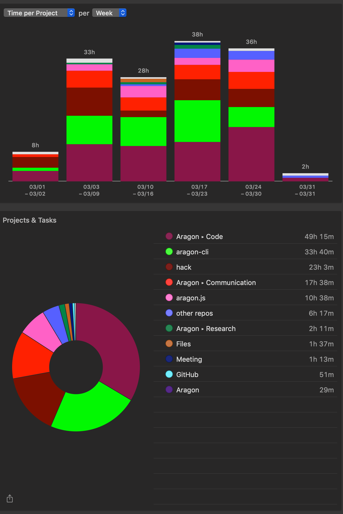

# Milestone 10

|       |                  |
| ----- | ---------------- |
| From  | 2019-03-01       |
| Until | 2019-03-31       |
| Hours | 147              |
| Asked | 7350 DAI @ 50/hr |
| Given | 7350 DAI         |

## References

Tx: <https://etherscan.io/tx/0x2e1adcbc3da9dc7c31175be65ad4854777acd28f3551c132a90faa23d83f1067>

## Description

### Work in progress

#### aragon-cli

- [#387 Token Manager revert on initialize](https://github.com/aragon/aragon-cli/issues/387)
- [#357 Reusing artifacts on apm publish should sanity check artifact](https://github.com/aragon/aragon-cli/issues/357)
- [#394 Import devchain from aragen (new--verbose option)](https://github.com/aragon/aragon-cli/pull/394)

#### aragon-desktop

- [#65 Aragon 0.6.4 doesn't load](https://github.com/aragon/aragon-desktop/issues/65)

### Opened these PRs

#### aragon-cli

- [#414 Update kits to templates](https://github.com/aragon/aragon-cli/pull/414)
- [#389 Add new template for tutorial](https://github.com/aragon/aragon-cli/pull/389)
- [#386 Yargs12](https://github.com/aragon/aragon-cli/pull/386)

#### hack

- [#127 aragonAPI docs restructure](https://github.com/aragon/hack/pull/127)
- [#121 Include templates reviews](https://github.com/aragon/hack/pull/121)
- [#119 Change kits to templates](https://github.com/aragon/hack/pull/119)
- [#113 Fix: broken links](https://github.com/aragon/hack/pull/113)
- [#99 Update aragonCLI documentation](https://github.com/aragon/hack/pull/99)

#### other repos

- [aragon.js/#271 Docs update: include react hooks & fixes](https://github.com/aragon/aragon.js/pull/271)
- [aragen/#31 Include agent app to snapshot](https://github.com/aragon/aragen/pull/31)
- [aragon-react-boilerplate/#41 Merge react-kit](https://github.com/aragon/aragon-react-boilerplate/pull/41)

### Tested/reviewed these PRs

#### aragon-cli

- [#420 Import docs from hack](https://github.com/aragon/aragon-cli/pull/420)
- [#406 Add ipfs view & ipfs propagate](https://github.com/aragon/aragon-cli/pull/406)
- [#399 Don't slice content hash in dao apps](https://github.com/aragon/aragon-cli/pull/399)
- [#390 Port e2e tests to node](https://github.com/aragon/aragon-cli/pull/390)
- [#253 add apm info & packages cmds](https://github.com/aragon/aragon-cli/pull/253)

#### hack

- [#114 Publish: add recommendation for relative paths and more IPFS-related guidance](https://github.com/aragon/hack/pull/114)
- [#109 Document apm info + apm packages](https://github.com/aragon/hack/pull/109)

#### other repos

- [aragon-react-boilerplate/#46 Add test sample for counter app](https://github.com/aragon/aragon-react-boilerplate/pull/46)
- [your-first-aragon-app/#1 Add .ipfsignore and @babel/polyfill dependency](https://github.com/aragon/your-first-aragon-app/pull/1)

### Opened/discussed these issues

#### aragon-cli

- [#419 Provide baseline ABIs bundle with aragonCLI](https://github.com/aragon/aragon-cli/issues/419)
- [#415 Create new package for ipfs-cmds](https://github.com/aragon/aragon-cli/issues/415)
- [#417 Testing roadmap](https://github.com/aragon/aragon-cli/issues/417)
- [#397 Iterate on the `apm info` command](https://github.com/aragon/aragon-cli/issues/397)
- [#395 Update dependencies](https://github.com/aragon/aragon-cli/issues/395)
- [#364 Update documentation](https://github.com/aragon/aragon-cli/issues/364)
- [#349 aragon ipfs command use is obscure and undocumented](https://github.com/aragon/aragon-cli/issues/349)
- [#348 Document aragon publish command on how to publish just "dist" folder to ipfs instead of the whole project](https://github.com/aragon/aragon-cli/issues/348)

#### hack

- [#126 Add new IPFS commands](https://github.com/aragon/hack/issues/126)
- [#120 dao-kit links update](https://github.com/aragon/hack/issues/120)
- [#122 Add troubleshooting section on how to recover a trapped token using aragonCLI](https://github.com/aragon/hack/issues/122)
- [#123 Guide: Aragon and IPFS](https://github.com/aragon/hack/issues/123)
- [#115 Guide: The Agent app](https://github.com/aragon/hack/issues/115)
- [#116 API documentation links are broken](https://github.com/aragon/hack/issues/116)
- [#107 Add documentation about apm info & packages commands](https://github.com/aragon/hack/issues/107)
- [#106 Guide: How to use Frame](https://github.com/aragon/hack/issues/106)
- [#87 Update aragonCLI documentation](https://github.com/aragon/hack/issues/87)
- [#23 Add technical specs (e.g. json files)](https://github.com/aragon/hack/issues/23)
- [#15 Sanity check Your First Aragon App](https://github.com/aragon/hack/issues/15)

#### boilerplates

- [aragon-react-kit-boilerplate/#25 Archive boilerplate](https://github.com/aragon/aragon-react-kit-boilerplate/issues/25)
- [aragon-react-boilerplate/#43 App display a white page](https://github.com/aragon/aragon-react-boilerplate/issues/43)
- [aragon-react-boilerplate/#45 Update arrap.json to environments default](https://github.com/aragon/aragon-react-boilerplate/issues/45)

#### other repos

- [aragen/#29 Discussion: Move aragen to aragonCLI monorepo](https://github.com/aragon/aragen/issues/29)
- [aragen/#12 Migrate `aragon-cli devchain` logic to aragen so it can be run standalone](https://github.com/aragon/aragen/issues/12)
- [aragen/#10 Deploy open.aragonpm.eth APM registry as part of gen](https://github.com/aragon/aragen/issues/10)

- [Docusaurus/#4 Merge with latest from upstream (v1.7.3) ](https://github.com/aragon/Docusaurus/pull/4)
- [aragon-wiki/#439 Add documentation about how to recover a trapped token using the CLI](https://github.com/aragon/aragon-wiki/issues/439)
- [aragon-apps/#724 Unexpected "With `useBuiltins` option, required direct setting of `corejs`"](https://github.com/aragon/aragon-apps/issues/724)

I have also spent a couple of days working on our Nest proposal:

- [#148 Aragon Nest Proposal: aragonCLI](https://github.com/aragon/nest/issues/148)
- [#151 aragonCLI proposal](https://github.com/aragon/nest/pull/151)

## Report

