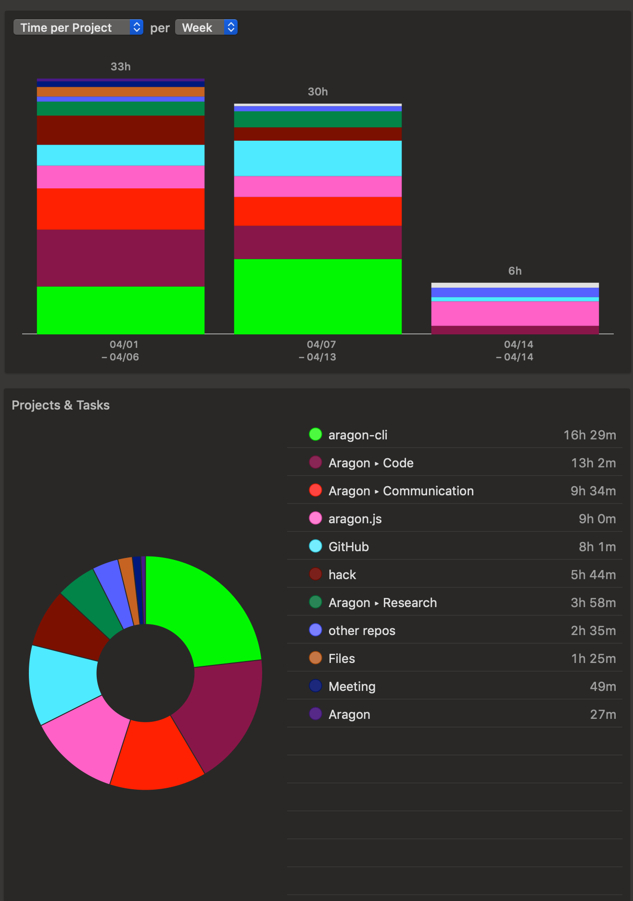

# Milestone 11

|       |                    |
| ----- | ------------------ |
| From  | 2019-04-01         |
| Until | 2019-04-14         |
| Hours | 71.13              |
| Asked | 3556.5 DAI @ 50/hr |
| Given | -                  |

## References

## Description

### Work in progress

- [#510 New script deploy-apm-open](https://github.com/aragon/aragonOS/pull/510)
- [#426 Sanity check artifacts in apm publish](https://github.com/aragon/aragon-cli/pull/426)

### Opened these PRs

- [#432 Testing strategy](https://github.com/aragon/aragon-cli/pull/432)
- [#428 Add issues and PR templates, edit contributing.md && add codeowners](https://github.com/aragon/aragon-cli/pull/428)
- [#5 Fix css typo](https://github.com/aragon/Docusaurus/pull/5)
- [#127 aragonAPI docs restructure](https://github.com/aragon/hack/pull/127)
- [#271 Docs update: include react api, aragon app architecture & fixes](https://github.com/aragon/aragon.js/pull/271)

### Tested/reviewed these PRs

- [#433 Update PULL_REQUEST_TEMPLATE.md](https://github.com/aragon/aragon-cli/pull/433)
- [#434 Update README.md](https://github.com/aragon/aragon-cli/pull/434)
- [#133 Restyling of docs texts and titles](https://github.com/aragon/hack/pull/133)
- [#125 App center documentation](https://github.com/aragon/hack/pull/125)
- [#46 Add test sample for counter app](https://github.com/aragon/aragon-react-boilerplate/pull/46)

### Opened/discussed these issues

- [#134 Edit button on generated docs are broken](https://github.com/aragon/hack/issues/134)
- [#10 Deploy open.aragonpm.eth APM registry as part of gen](https://github.com/aragon/aragen/issues/10)

## Report

