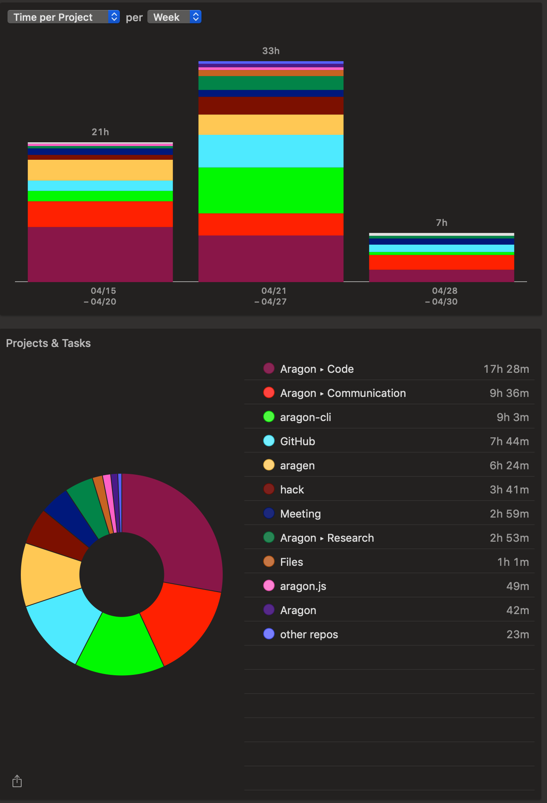

# Milestone 12

|       |                  |
| ----- | ---------------- |
| From  | 2019-04-15       |
| Until | 2019-04-30       |
| Hours | 62.80            |
| Asked | 3140 DAI @ 50/hr |
| Given | -                |

## References

## Description

### Work in progress

[#419 Provide baseline ABIs bundle with aragonCLI](https://github.com/aragon/aragon-cli/issues/419)

### Opened these PRs

[#33 New open.aragonpm script to deploy APM Registry](https://github.com/aragon/aragen/pull/33)

[#35 Fix travis miss ipfs-cache and aragon-ganche](https://github.com/aragon/aragen/pull/35)

[#31 Include agent app to snapshot](https://github.com/aragon/aragen/pull/31)

[#446 Update client version to bella](https://github.com/aragon/aragon-cli/pull/446)

### Tested/reviewed these PRs

[#139 Draft: Improved getting-started page](https://github.com/aragon/hack/pull/139)

[#137 Fix edit button for CLI and JS docs](https://github.com/aragon/hack/pull/137)

[#394 Import devchain from aragen (new--verbose option)](https://github.com/aragon/aragon-cli/pull/394)

[#255 New command aragon start with refactor](https://github.com/aragon/aragon-cli/pull/255)

[#437 Group documents in docs-internal](https://github.com/aragon/aragon-cli/pull/437)

### Opened/discussed these issues

[#34 Deploy old versions of core apps to mimic mainnet deployment](https://github.com/aragon/aragen/issues/34)

[#22 Publish survey kit](https://github.com/aragon/aragen/issues/22)

[#10 Deploy open.aragonpm.eth APM registry as part of gen](https://github.com/aragon/aragen/issues/10)

[#36 Move aragonID deployment script to aragen and use @aragon/id as dependency](https://github.com/aragon/aragen/issues/36)

[#30 Include Agent app in snapshot](https://github.com/aragon/aragen/issues/30)

[#264 aragon devchain does not show the output of ganache](https://github.com/aragon/aragon-cli/issues/264)

[#98 Create 'aragon start' command using wrapper's 'npm run start:dev'](https://github.com/aragon/aragon-cli/issues/98)

[#445 Split ipfs rpc options](https://github.com/aragon/aragon-cli/issues/445)

[#443 Update client version to Bella](https://github.com/aragon/aragon-cli/issues/443)

[#435 Iterate on `dao act`](https://github.com/aragon/aragon-cli/issues/435)

[#819 Dot Voting app not showing side panel for closed votes on safari](https://github.com/AutarkLabs/planning-suite/issues/819)

[#510 New script deploy-apm-open](https://github.com/aragon/aragonOS/pull/510)

## Report

