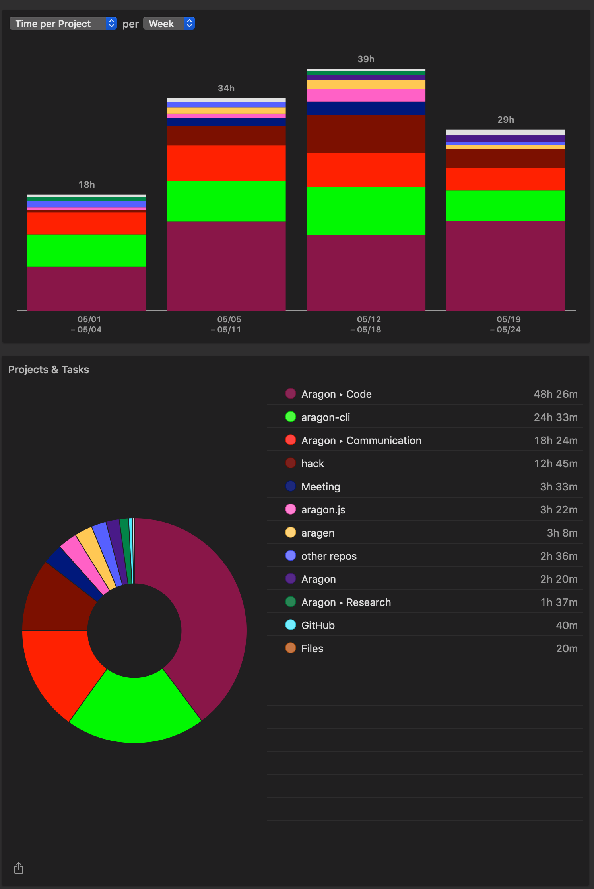

# Milestone 13

|       |                  |
| ----- | ---------------- |
| From  | 2019-05-01       |
| Until | 2019-05-24       |
| Hours | 121.82           |
| Asked | 6091 DAI @ 50/hr |
| Given | 6091 DAI         |

## References

Tx: <https://etherscan.io/tx/0xc7f0e61d1c36bfe1e3b7c59b51b3e0aaf5f8fc37b44969603a5de4cf4febcf62>

## Description

### Work in progress

### Opened these PRs

2019-05-23 **aragon-cli** [#481 Include IPFS timeout and Aragon node as default for environments](https://github.com/aragon/aragon-cli/pull/481)

2019-05-21 **hack** [#157 Polish Publish Guide](https://github.com/aragon/hack/pull/157)

2019-05-21 **aragon-bare-boilerplate** [#15 Update arapp.json](https://github.com/aragon/aragon-bare-boilerplate/pull/15)

2019-05-21 **aragon-react-boilerplate** [#56 Update arapp.json](https://github.com/aragon/aragon-react-boilerplate/pull/56)

2019-05-21 **aragon-cli** [#458 Iterate on apm versions](https://github.com/aragon/aragon-cli/pull/458)

2019-05-21 **hack** [#159 Add style improvements for sidebar](https://github.com/aragon/hack/pull/159)

2019-05-18 **aragon-cli** [#473 Bump minor](https://github.com/aragon/aragon-cli/pull/473)

2019-05-18 **aragen** [#40 Bump minor client](https://github.com/aragon/aragen/pull/40)

2019-05-15 **aragon-cli** [#462 Deprecated functions ](https://github.com/aragon/aragon-cli/pull/462)

2019-05-17 **hack** [#153 Fix Frame siderbar label](https://github.com/aragon/hack/pull/153)

2019-05-15 **hack** [#148 How to use Frame](https://github.com/aragon/hack/pull/148)

2019-05-12 **hack** [#147 Change URL aragonjs for api-js](https://github.com/aragon/hack/pull/147)

2019-05-6 **aragon-react-boilerplate** [#53 Add repo structure section](https://github.com/aragon/aragon-react-boilerplate/pull/53#pullrequestreview-234191720)

### Tested/reviewed these PRs

2019-05-23 **hack** [#161 Update getting-started.md](https://github.com/aragon/hack/pull/161)

2019-05-22 **hack** [#154 Update images in github-guide.md + minor edits](https://github.com/aragon/hack/pull/154)

2019-05-22 **aragen** [#42 rename snapshot path to ~/.aragon/aragen-db-{version}](https://github.com/aragon/aragen/pull/42)

2019-05-17 **aragon.js** [#304 Clean up API documentation](https://github.com/aragon/aragon.js/pull/304)

2019-05-17 **hack** [#139 Draft: Improved getting-started page](https://github.com/aragon/hack/pull/139)

2019-05-15 **aragon-cli** [#465 Update dependencies for all 🌴](https://github.com/aragon/aragon-cli/pull/465)

2019-05-1 **aragon-cli** [#454 Fix getDependentBinary](https://github.com/aragon/aragon-cli/pull/454#issuecomment-489345563)

### Opened/discussed these issues

2019-05-22 **hack** [#160 GitHub guide for contributors](https://github.com/aragon/hack/issues/160)

2019-05-22 **aragen** [#39 Rename snapshot path from ~/.aragon/ganache-db-{version} to ~/.aragon/aragen-db-{version}](https://github.com/aragon/aragen/issues/39)

2019-05-21 **hack** [#128 Check the publish guide](https://github.com/aragon/hack/issues/128)

2019-05-21 **planning-suite** [#907 Projects app does not authorize GitHub](https://github.com/AutarkLabs/planning-suite/issues/907)

2019-05-21 **aragon-cli** [#474 Update transaction path descripition ](https://github.com/aragon/aragon-cli/issues/474)

2019-05-19 **aragon-cli** [#321 Cannot create dao with ganache-core@2.3](https://github.com/aragon/aragon-cli/issues/321)

2019-05-19 **aragon-cli** [#282 Wrong options provided by `--help` for subcommands](https://github.com/aragon/aragon-cli/issues/282)

2019-05-18 **aragon-cli** [#412 Code owners](https://github.com/aragon/aragon-cli/issues/412)

2019-05-18 **aragon-cli** [#387 Token Manager revert on initialize](https://github.com/aragon/aragon-cli/issues/387)

2019-05-17 **hack** [#106 Guide: How to use Frame](https://github.com/aragon/hack/issues/106)

2019-05-17 **hack** [#150 Iterate on How to use Frame guide](https://github.com/aragon/hack/issues/150)

2019-05-12 **hack** [#145 Rename 'aragonjs' URLs to 'api-js-\*'](https://github.com/aragon/hack/issues/145)

2019-05-10 **aragon-cli** [#450 On major deployments, add `methods` from old versions' artifact.jsons](https://github.com/aragon/aragon-cli/issues/450#issuecomment-491312414)

## Report

