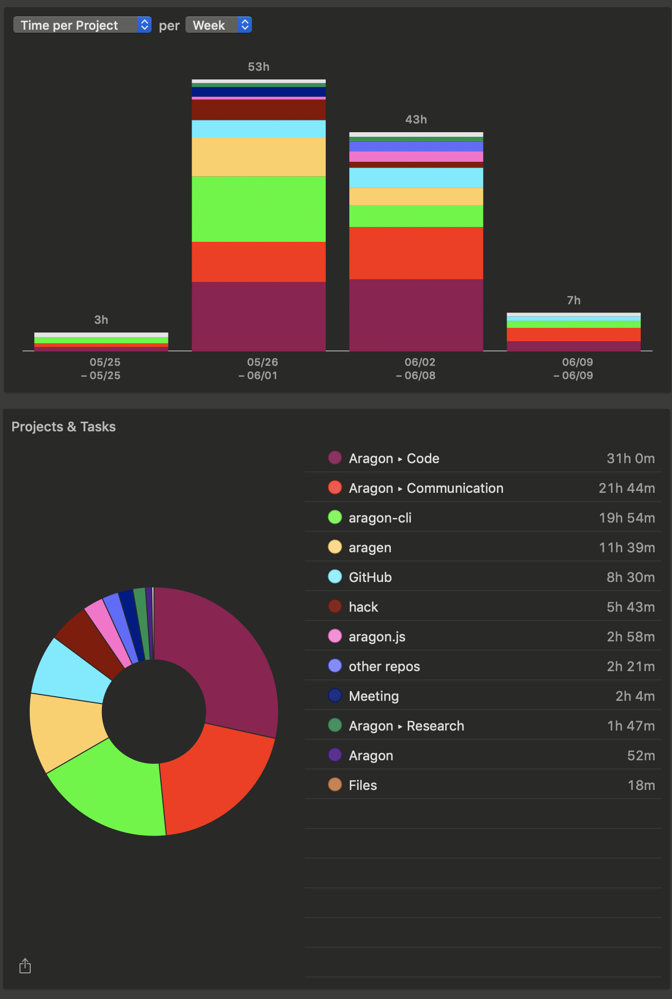

# Milestone 14

|       |                  |
| ----- | ---------------- |
| From  | 2019-05-25       |
| Until | 2019-06-09       |
| Hours | 108.00           |
| Asked | 4320 DAI @ 40/hr |
| Given | 4320 DAI         |

## References

Tx: <https://etherscan.io/tx/0x9da19b06ae97457fee7860f9f9ad544a3405de9348898867ee8d6e77160472d7>

## Description

### Work in progress

### Opened these PRs

2019-06-07 **aragon-cli** [#504 Update aragonCLI Roadmap](https://github.com/aragon/aragon-cli/pull/504)

2019-06-06 **aragon-cli** [#502 Update Labels.md](https://github.com/aragon/aragon-cli/pull/502)

2019-06-06 **aragon-cli** [#503 Include links to Specification](https://github.com/aragon/aragon-cli/pull/503)

2019-06-05 **aragon-cli** [#500 Update master with 5.9.4](https://github.com/aragon/aragon-cli/pull/500)

2019-06-04 **dao-kits** [#75 Add deploy script for survey kit](https://github.com/aragon/dao-kits/pull/75)

2019-06-04 **dao-kits** [#74 Fix survey template ](https://github.com/aragon/dao-kits/pull/74)

2019-06-03 **aragon-apps** [#880 Include assets for the agent app](https://github.com/aragon/aragon-apps/pull/880)

2019-06-02 **dao-kits** [#75 Add deploy script for survey kit](https://github.com/aragon/dao-kits/pull/75)

2019-06-02 **aragen** [#47 Add survey-kit to snapshot & fix agent and vault deployment](https://github.com/aragon/aragen/pull/47)

2019-06-01 **hack** [#168 Remove comments](https://github.com/aragon/hack/pull/168)

2019-06-01 **dao-kits** [#74 Fix survey template ](https://github.com/aragon/dao-kits/pull/74)

2019-05-31 **aragon-cli** [#492 Iterate dao act](https://github.com/aragon/aragon-cli/pull/492)

2019-05-31 **hack** [#165 Style fixes on sidebar](https://github.com/aragon/hack/pull/165)

2019-05-30 **aragon-cli** [#490 Fix: create-aragon-app](https://github.com/aragon/aragon-cli/pull/490)

2019-05-30 **aragon-cli** [#462 Deprecated functions ](https://github.com/aragon/aragon-cli/pull/462)

2019-05-28 **hack** [#159 Add style improvements for the sidebar](https://github.com/aragon/hack/pull/159)

### Tested/reviewed these PRs

2019-06-01 **hack** [#115 Guide: The Agent app](https://github.com/aragon/hack/issues/115)

2019-05-29 **aragen** [#39 Rename snapshot path from ~/.aragon/ganache-db-{version} to ~/.aragon/aragen-db-{version}](https://github.com/aragon/aragen/issues/39)

2019-05-27 **aragon-cli** [#451 Output proxy app address when installing app with dao install](https://github.com/aragon/aragon-cli/issues/451)

### Opened/discussed these issues

2019-06-09 **aragon-cli** [#497 dao acl create: Cannot read property 'description' of undefined](https://github.com/aragon/aragon-cli/issues/497)

2019-06-06 **aragon-cli** [#321 Cannot create dao with ganache-core@2.3](https://github.com/aragon/aragon-cli/issues/321)

2019-06-06 **aragon-cli** [#350 "gas required exceeds allowance or always failing transaction" when calling dao acl grant](https://github.com/aragon/aragon-cli/issues/350)

2019-06-06 **aragon-cli** [#474 Update transaction path descripition ](https://github.com/aragon/aragon-cli/issues/474)

2019-06-02 **aragen** [#48 Publish TPS, pando and Fundraising to open.aragonpm.eth](https://github.com/aragon/aragen/issues/48)

2019-06-01 **hack** [#115 Guide: The Agent app](https://github.com/aragon/hack/issues/115)

2019-06-01 **aragon-apps** [#880 Include assets for the agent app](https://github.com/aragon/aragon-apps/pull/880)

2019-06-01 **aragen** [#46 Deploy Agent and Vault apps correctly](https://github.com/aragon/aragen/issues/46)

2019-06-01 **deployments** [#91 Publish Agent app without irrelevant file and include metadata](https://github.com/aragon/deployments/issues/91)

2019-05-29 **aragon-cli** [#452 Allow declaring external contract dependencies](https://github.com/aragon/aragon-cli/issues/452)

2019-05-29 **aragon-desktop** [#69 install error](https://github.com/aragon/aragon-desktop/issues/69)

2019-05-29 **aragon-desktop** [#71 Make Aragon Desktop compatible with Windows](https://github.com/aragon/aragon-desktop/issues/71)

2019-05-29 **aragon-cli** [#466 Insufficient funds for gas \* price + value](https://github.com/aragon/aragon-cli/issues/466)

2019-05-28 **hack** [#162 Update CONTRIBUTING.md and create docs-internal assets](https://github.com/aragon/hack/pull/162)

2019-05-28 **hack** [#164 Enhacements](https://github.com/aragon/hack/pull/164)

2019-05-28 **aragon-cli** [#477 Start using shrinkwrap](https://github.com/aragon/aragon-cli/issues/477)

2019-05-28 **aragon-cli** [#487 Use dependabot as an alternative to greenkeeper](https://github.com/aragon/aragon-cli/issues/487)

## Report

I also spent some time writing a couple of post on the Forum ([link1](https://forum.aragon.org/t/experimenting-with-bounties-using-the-projects-app/1016/7), [link2](https://forum.aragon.org/t/test-organization-for-decentralizing-aragonpm-eth-agp-28/1029))

