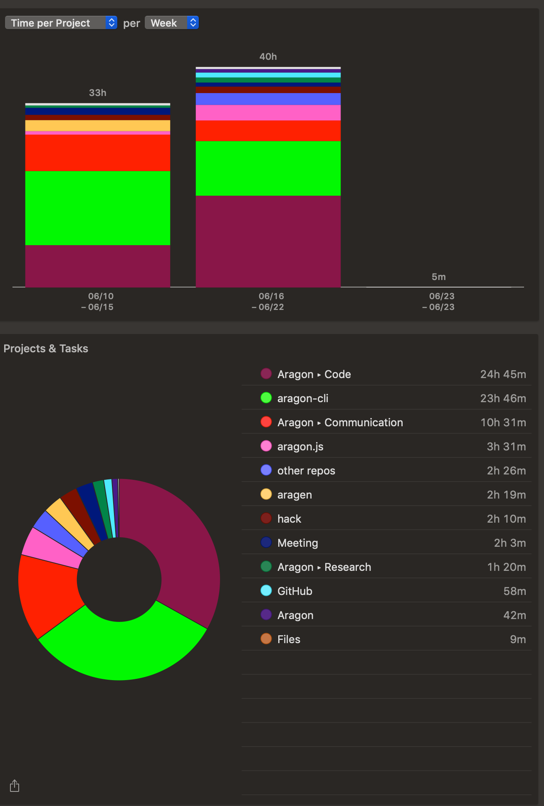

# Milestone 15

|       |                     |
| ----- | ------------------- |
| From  | 2019-06-10          |
| Until | 2019-06-23          |
| Hours | 74.77               |
| Asked | 2990.80 DAI @ 40/hr |
| Given | -                   |

## References

## Description

### Work in progress

### Opened these PRs

2019-06-23 **aragon-desktop** [#75 Update client](https://github.com/aragon/aragon-desktop/pull/75)

2019-06-22 **aragon-cli** [#543 Include documentation about links](https://github.com/aragon/aragon-cli/pull/543)

2019-06-22 **hack** [#174 Small troubleshooting update](https://github.com/aragon/hack/pull/174)

2019-06-21 **aragon-cli** [#545 Refactor e2e test](https://github.com/aragon/aragon-cli/pull/545)

2019-06-19 **aragon-cli** [#541 Refactor: Remove init command & network option. Clean apm](https://github.com/aragon/aragon-cli/pull/541)

2019-06-19 **aragon-cli** [#426 Sanity check artifacts in apm publish](https://github.com/aragon/aragon-cli/pull/426)

2019-06-18 **hack** [#173 Add sidebar link](https://github.com/aragon/hack/pull/173)

2019-06-17 **dao-kits** [#82 Update arrap.json with ipfs gateway and wsRPC](https://github.com/aragon/dao-kits/pull/82)

2019-06-16 **your-first-aragon-app** [#3 Add @aragon/api dependency](https://github.com/aragon/your-first-aragon-app/pull/3)

2019-06-12 **aragen** [#50 Update yargs and update scripts](https://github.com/aragon/aragen/pull/50)

2019-06-12 **aragon-cli** [#332 Require artifacts when fetching published repo](https://github.com/aragon/aragon-cli/pull/332)

2019-06-12 **aragon-cli** [#455 Handle Aragon gateway on environment middleware](https://github.com/aragon/aragon-cli/pull/455)

2019-06-12 **aragon-cli** [#510 Update to yargs 13](https://github.com/aragon/aragon-cli/pull/510)

2019-06-12 **aragon-react-boilerplate** [#60 Update default environment to use open subdomain](https://github.com/aragon/aragon-react-boilerplate/pull/60)

2019-06-12 **aragon-bare-boilerplate** [#16 Update default environment to use open subdomain](https://github.com/aragon/aragon-bare-boilerplate/pull/16)

2019-06-12 **hack** [#171 Include rewarded section on CONTRIBUTING.md](https://github.com/aragon/hack/pull/171)

2019-06-11 **aragen** [#49 Create CONTRIBUTING.md](https://github.com/aragon/aragen/pull/49)

2019-06-11 **aragon-cli** [#508 Update CONTRIBUTING.md](https://github.com/aragon/aragon-cli/pull/508)

### Tested/reviewed these PRs

2019-06-21 **your-first-aragon-app** [#5 Fixed constructor issue](https://github.com/aragon/your-first-aragon-app/pull/5)

2019-06-19 **aragon-cli** [#233 Apm cleanup](https://github.com/aragon/aragon-cli/pull/233)

2019-06-16 **aragon-cli** [#519 Fix a bunch of stuff](https://github.com/aragon/aragon-cli/pull/519)

2019-06-13 **aragon-cli** [#513 Set-up Continuous Deployment](https://github.com/aragon/aragon-cli/pull/513)

2019-06-12 **aragen** [#5 [WIP] Add survey](https://github.com/aragon/aragen/pull/5)

2019-06-12 **aragen** [#4 [WIP] Automatically generate environment after install](https://github.com/aragon/aragen/pull/4)

2019-06-12 **hack** [#167 Draft: Aragon Agent Guide](https://github.com/aragon/hack/pull/167)

### Opened/discussed these issues

2019-06-23 **aragon-desktop** [#73 Update dependencies to prevent scrypt not found](https://github.com/aragon/aragon-desktop/issues/73)

2019-06-23 **aragon-desktop** [#74 Open organization button not working once we choose the first org](https://github.com/aragon/aragon-desktop/issues/74)

2019-06-22 **futarchy-app** [#133 ENOLOCAL when npm i from master](https://github.com/levelkdev/futarchy-app/issues/133)

2019-06-22 **aragon-cli** [#549 aragonCLI install failing on clean Ubuntu install](https://github.com/aragon/aragon-cli/issues/549)

2019-06-18 **aragon-cli** [#497 dao acl create: Cannot read property 'description' of undefined](https://github.com/aragon/aragon-cli/issues/497)

2019-06-17 **aragon-desktop** [#72 Could not start IPFS instance](https://github.com/aragon/aragon-desktop/issues/72)

2019-06-17 **deployments** [#91 Publish Agent app without irrelevant file and include metadata](https://github.com/aragon/deployments/issues/91)

2019-06-17 **your-first-aragon-app** [#4 Start using shrinkwrap](https://github.com/aragon/your-first-aragon-app/issues/4)

2019-06-16 **aragon-cli** [#521 Add Changelog file](https://github.com/aragon/aragon-cli/issues/521)

2019-06-16 **aragon-cli** [#524 dao exec: output broken](https://github.com/aragon/aragon-cli/issues/524)

2019-06-15 **aragon.js** [#325 Intermittent issue trying to access repo artifacts from aragonCLI](https://github.com/aragon/aragon.js/issues/325)

2019-06-14 **aragon-cli** [#505 Improve the reliability when downloading IPFS at installation](https://github.com/aragon/aragon-cli/issues/505)

2019-06-12 **aragon-cli** [#509 Detect IPFS or HTTP server wasn't running and warn before fetching artifacts](https://github.com/aragon/aragon-cli/issues/509)

2019-06-12 **aragon-cli** [#497 dao acl create: Cannot read property 'description' of undefined](https://github.com/aragon/aragon-cli/issues/497)

2019-06-12 **aragon-cli** [#512 Output publish information to decide before publishing](https://github.com/aragon/aragon-cli/issues/512)

2019-06-12 **hack** [#110 Generate aragonOS docs](https://github.com/aragon/hack/issues/110)

2019-06-12 **hack** [#170 Who wrote the docs sync scripts?](https://github.com/aragon/hack/issues/170)

## Report

