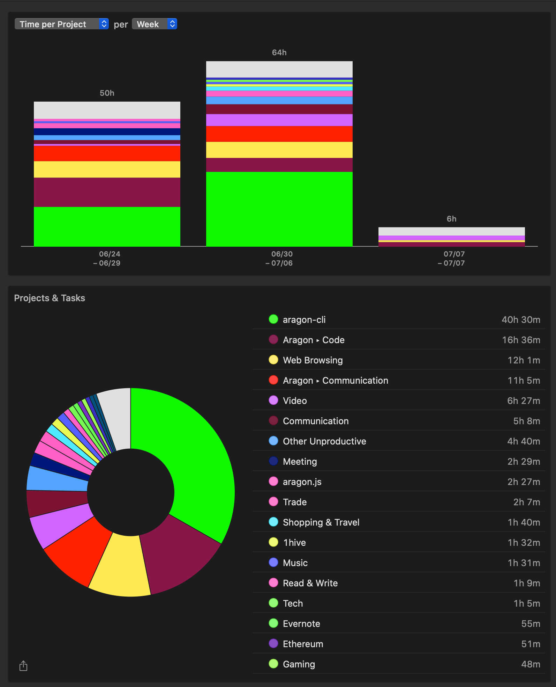

# Milestone 16

|       |                     |
| ----- | ------------------- |
| From  | 2019-06-24          |
| Until | 2019-07-07          |
| Hours | 74.87               |
| Asked | 3743.50 DAI @ 50/hr |
| Given | -                   |

## References

## Description

### Work in progress

2019-06-27 **aragon-desktop** [#75 [WIP] Update client](https://github.com/aragon/aragon-desktop/pull/75)

### Opened these PRs

2019-07-07 **aragon-cli** [#589 Update CHANGELOG.md](https://github.com/aragon/aragon-cli/pull/589)

2019-07-06 **aragon-cli** [#587 Fix run test & update snapshot](https://github.com/aragon/aragon-cli/pull/587)

2019-07-06 **aragon-cli** [#588 Revert "Bump ignore from 4.0.6 to 5.1.2"](https://github.com/aragon/aragon-cli/pull/588)

2019-07-06 **aragon-cli** [#504 Update aragonCLI Roadmap](https://github.com/aragon/aragon-cli/pull/504)

2019-07-06 **aragon-cli** [#590 v6.0.1](https://github.com/aragon/aragon-cli/pull/590)

2019-07-05 **apm.js** [#37 Refactor: Add uploadFilesToStorageProvider function to API](https://github.com/aragon/apm.js/pull/37)

2019-07-05 **aragon-cli** [#570 Refactor artifact generation & improve sanity check](https://github.com/aragon/aragon-cli/pull/570)

2019-07-05 **aragon-apps** [#905 Add prepublish script before publishing to aragonPM](https://github.com/aragon/aragon-apps/pull/905)

2019-07-05 **aragon-bare-boilerplate** [#19 Update default prepublish script](https://github.com/aragon/aragon-bare-boilerplate/pull/19)

2019-07-05 **aragon-react-boilerplate** [#63 Update default prepublish script](https://github.com/aragon/aragon-react-boilerplate/pull/63)

2019-07-05 **aragon-cli** [#574 Output publish information before publishing](https://github.com/aragon/aragon-cli/pull/574)

2019-07-05 **aragon-cli** [#586 @aragon/cli@6.0.0](https://github.com/aragon/aragon-cli/pull/586)

2019-07-03 **aragon-cli** [#571 New prepublish option for apm publish](https://github.com/aragon/aragon-cli/pull/571)

2019-07-03 **apm.js** [#37 Refactor: Add uploadFilesToStorageProvider function to API](https://github.com/aragon/apm.js/pull/37)

2019-07-02 **aragon-cli** [#574 Output publish information before publishing](https://github.com/aragon/aragon-cli/pull/574)

2019-07-02 **dao-kits** [#82 Update arrap.json with wsRPC](https://github.com/aragon/dao-kits/pull/82)

2019-06-28 **aragon-cli** [#555 Update dao token new options](https://github.com/aragon/aragon-cli/pull/555)

2019-06-27 **aragon-cli** [#545 Fix e2e test setup](https://github.com/aragon/aragon-cli/pull/545)

2019-06-27 **aragon-cli** [#562 Add appveyor.yml to prevent CI fail](https://github.com/aragon/aragon-cli/pull/562)

### Tested/reviewed these PRs

2019-07-06 **aragon-cli** [#556 Bump eslint-plugin-import from 2.17.3 to 2.18.0](https://github.com/aragon/aragon-cli/pull/556)

2019-07-06 **aragon-cli** [#576 Bump semver from 6.1.1 to 6.2.0](https://github.com/aragon/aragon-cli/pull/576)

2019-07-06 **aragon-cli** [#577 Bump truffle-hdwallet-provider from 1.0.10 to 1.0.13](https://github.com/aragon/aragon-cli/pull/577)

2019-07-06 **aragon-cli** [#575 Bump husky from 2.4.1 to 3.0.0](https://github.com/aragon/aragon-cli/pull/575)

2019-07-06 **aragon-cli** [#559 Added pre-requisites section](https://github.com/aragon/aragon-cli/pull/559)

2019-07-02 **aragon-cli** [#528 Make go-ipfs optional](https://github.com/aragon/aragon-cli/pull/528)

2019-06-24 **your-first-aragon-app** [#6 Fixed constructor issue](https://github.com/aragon/your-first-aragon-app/pull/6)

### Opened/discussed these issues

2019-07-06 **aragon-cli** [#535 Ask whether to propagate artifacts after publishing](https://github.com/aragon/aragon-cli/issues/535)

2019-07-06 **aragon-cli** [#549 aragonCLI install failing on clean Ubuntu install](https://github.com/aragon/aragon-cli/issues/549)

2019-07-06 **aragon-cli** [#487 Use dependabot as an alternative to greenkeeper](https://github.com/aragon/aragon-cli/issues/487)

2019-07-06 **aragen** [#55 Customize network id of the devchain](https://github.com/aragon/aragen/issues/55)

2019-07-06 **aragon-cli** [#413 Customize network id of the devchain](https://github.com/aragon/aragon-cli/issues/413)

2019-07-06 **aragon-cli** [#480 An in-range update of semver is breaking the build 🚨](https://github.com/aragon/aragon-cli/issues/480)

2019-07-06 **aragon-cli** [#482 An in-range update of eslint-plugin-node is breaking the build 🚨](https://github.com/aragon/aragon-cli/issues/482)

2019-07-06 **aragon-cli** [#544 An in-range update of truffle-hdwallet-provider is breaking the build 🚨](https://github.com/aragon/aragon-cli/issues/544)

2019-07-06 **aragon-cli** [#479 An in-range update of truffle is breaking the build 🚨](https://github.com/aragon/aragon-cli/issues/479)

2019-07-06 **aragon-cli** [#143 Attempt to fetch current version artifact.json instead of generating it when publishing only content](https://github.com/aragon/aragon-cli/issues/143)

2019-07-05 **aragon-cli** [#585 Update artifact.json generation to use all evnrionments](https://github.com/aragon/aragon-cli/issues/585)

2019-07-05 **aragon-cli** [#512 Output publish information to decide before publishing](https://github.com/aragon/aragon-cli/issues/512)

2019-07-03 **aragon-cli** [#430 Automatically run `prepublish` or `prepublishOnly` scripts on `aragon apm publish`](https://github.com/aragon/aragon-cli/issues/430)

2019-07-03 **aragon-cli** [#365 apm publish should generate code.sol on minor and patch versions as well](https://github.com/aragon/aragon-cli/issues/365)

2019-07-02 **aragen** [#54 New command: devchain status](https://github.com/aragon/aragen/issues/54)

2019-07-01 **aragon-cli** [#573 Limit deploying to http only if on a localhost server](https://github.com/aragon/aragon-cli/issues/573)

2019-06-28 **aragon-cli** [#561 Do not deploy a minime factory for each `dao token new`](https://github.com/aragon/aragon-cli/issues/561)

2019-06-27 **aragon-cli** [#563 Proper configure AppVeyor.yml](https://github.com/aragon/aragon-cli/issues/563)

2019-06-27 **aragon-cli** [#536 End-to-end test for publishing](https://github.com/aragon/aragon-cli/issues/536)

2019-06-27 **aragon-cli** [#147 Illegal char error when using illegal ENS chars in app name during aragon init](https://github.com/aragon/aragon-cli/issues/147)

2019-06-26 **aragon-apps** [#630 Token Manager displays "Transferrable: Yes" when token is not transferrable. ](https://github.com/aragon/aragon-apps/issues/630)

2019-06-26 **aragen** [#53 Update ganache-vars mnemonic to use the same as @aragon/os/truffle-config](https://github.com/aragon/aragen/issues/53)

2019-06-25 **aragon-desktop** [#72 Could not start IPFS instance](https://github.com/aragon/aragon-desktop/issues/72)

2019-06-24 **aragon-cli** [#466 Insufficient funds for gas \* price + value](https://github.com/aragon/aragon-cli/issues/466)

2019-06-24 **aragon-desktop** [#74 Open organization button not working once we choose the first org](https://github.com/aragon/aragon-desktop/issues/74)

## Report

