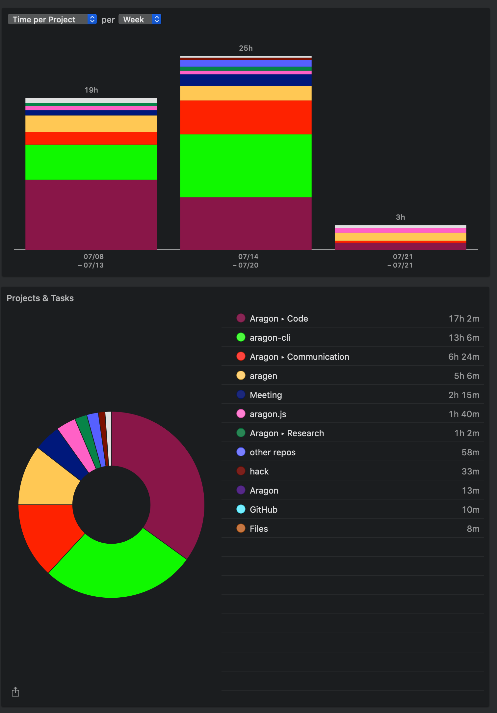

# Milestone 17

|       |                  |
| ----- | ---------------- |
| From  | 2019-07-08       |
| Until | 2019-07-21       |
| Hours | 48.72            |
| Asked | 2436 DAI @ 50/hr |
| Given | -                |

## References

## Description

### Work in progress

2019-07-19 **aragon-bare-boilerplate** [#20 Include template & update to new api](https://github.com/aragon/aragon-bare-boilerplate/pull/20)

2019-07-13 **aragen** [#60 Update scripts & dependencies](https://github.com/aragon/aragen/pull/60)

### Opened these PRs

2019-07-21 **aragon-cli** [#652 Refactor cli-utils package](https://github.com/aragon/aragon-cli/pull/652)

2019-07-19 **aragon-cli** [#646 Use all environment on artifact generation](https://github.com/aragon/aragon-cli/pull/646)

2019-07-17 **aragon-cli** [#625 Add gas-price global option](https://github.com/aragon/aragon-cli/pull/625)

2019-07-14 **aragon-cli** [#622 Fix yarn](https://github.com/aragon/aragon-cli/pull/622)

2019-07-14 **aragon-cli** [#624 Patch release](https://github.com/aragon/aragon-cli/pull/624)

2019-07-14 **aragon-react-boilerplate** [#65 Fix appId deployed to open.aragonpm.eth](https://github.com/aragon/aragon-react-boilerplate/pull/65)

2019-07-13 **aragon-react-boilerplate** [#64 Create .gitattributes](https://github.com/aragon/aragon-react-boilerplate/pull/64)

### Tested/reviewed these PRs

2019-07-21 **aragon-apps** [#915 Survey: Add sample survey kit](https://github.com/aragon/aragon-apps/pull/915)

2019-07-21 **aragon** [#874 Add build:local script](https://github.com/aragon/aragon/pull/874)

2019-07-19 **aragon-cli** [#635 Project name validation](https://github.com/aragon/aragon-cli/pull/635)

2019-07-18 **aragon-cli** [#636 Ipfs cmd refactor](https://github.com/aragon/aragon-cli/pull/636)

2019-07-11 **aragon** [#867 Deploy: deploy staging builds with now](https://github.com/aragon/aragon/pull/867)

2019-07-12 **hack** [#175 API: aragonAPI's docs moved to docs/API.md](https://github.com/aragon/hack/pull/175)

### Opened/discussed these issues

2019-07-21 **aragen** [#62 Include payroll app to snapshot](https://github.com/aragon/aragen/issues/62)

2019-07-21 **aragen** [#51 An in-range update of @aragon/cli is breaking the build 🚨](https://github.com/aragon/aragen/issues/51)

2019-07-21 **aragen** [#63 Include Open Enterprise to snapshot](https://github.com/aragon/aragen/issues/63)

2019-07-20 **hack** [#180 Add call initialize function step for the Agent app Guide](https://github.com/aragon/hack/issues/180)

2019-07-19 **aragon-cli** [#651 Option to specify a CID and skip the build process during publish](https://github.com/aragon/aragon-cli/issues/651)

2019-07-19 **aragon-cli** [#585 Update artifact.json generation to use all evnrionments](https://github.com/aragon/aragon-cli/issues/585)

2019-07-19 **aragon-react-boilerplate** [#67 Update to new dao-templates refactor](https://github.com/aragon/aragon-react-boilerplate/issues/67)

2019-07-19 **aragon-react-boilerplate** [#68 Improve truffle.config file](https://github.com/aragon/aragon-react-boilerplate/issues/68)

2019-07-19 **aragon-cli** [#147 Illegal char error when using illegal ENS chars in app name during aragon init](https://github.com/aragon/aragon-cli/issues/147)

2019-07-18 **aragon-cli** [#637 Been able to configure cli behavior](https://github.com/aragon/aragon-cli/issues/637)

2019-07-17 **aragon-cli** [#499 Allow manual configuration of gas price when using aragonCLI in Terminal](https://github.com/aragon/aragon-cli/issues/499)

2019-07-17 **aragon-cli** [#631 Iterate on gas-price option](https://github.com/aragon/aragon-cli/issues/631)

2019-07-15 **hack** [#172 Add numbering to Agent guide](https://github.com/aragon/hack/issues/172)

2019-07-15 **hack** [#178 Add numbering to Agent guide](https://github.com/aragon/hack/pull/178)

2019-07-15 **aragon-cli** [#628 Update changelogs & readmes](https://github.com/aragon/aragon-cli/pull/628)

2019-07-14 **aragon-react-boilerplate** [#65 Fix appId deployed to open.aragonpm.eth](https://github.com/aragon/aragon-react-boilerplate/pull/65)

2019-07-14 **aragon-cli** [#615 Fix up yarn installation](https://github.com/aragon/aragon-cli/issues/615)

2019-07-14 **aragon-cli** [#353 dao new has hardcoded gas price](https://github.com/aragon/aragon-cli/issues/353)

2019-07-12 **aragon-cli** [#347 Claiming an aragonid](https://github.com/aragon/aragon-cli/issues/347)

2019-07-12 **aragon.js** [#325 Intermittent issue trying to access repo artifacts from aragonCLI](https://github.com/aragon/aragon.js/issues/325)

## Report

