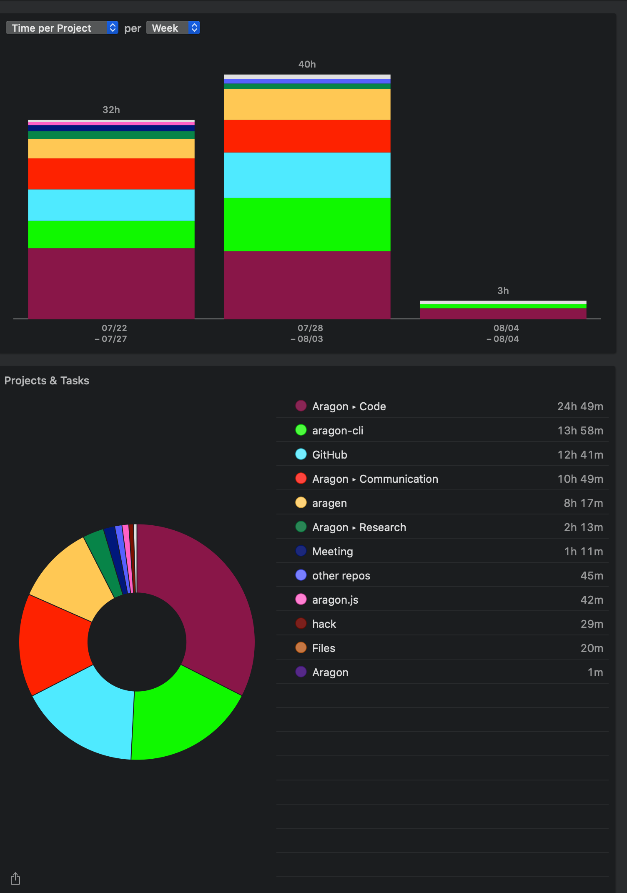

# Milestone 18

|       |                  |
| ----- | ---------------- |
| From  | 2019-07-22       |
| Until | 2019-08-04       |
| Hours | 76.35            |
| Asked | 3817 DAI @ 50/hr |
| Given | 3817 DAI         |

## References

Tx: <https://etherscan.io/tx/0x2885452cfa442fd08ca32dff98bf19a35e524b681daa8d49486be906fb980dca>

## Description

### Work in progress

2019-08-01 **aragon-react-boilerplate** [#69 Update contracts and dependencies to use new Templates](https://github.com/aragon/aragon-react-boilerplate/pull/69)

### Opened these PRs

2019-08-05 **aragon-cli** [#685 Fix prepare publish function and publish intent argument ](https://github.com/aragon/aragon-cli/pull/685)

2019-08-01 **aragen** [#70 Update devhcain to start](https://github.com/aragon/aragen/pull/70)

2019-08-01 **aragon-react-boilerplate** [#71 Small changes to be compatible with new publish script](https://github.com/aragon/aragon-react-boilerplate/pull/71)

2019-08-01 **aragon-cli** [#674 Update command to not hang after finishing](https://github.com/aragon/aragon-cli/pull/674)

2019-08-01 **aragon-cli** [#678 New command devchain status](https://github.com/aragon/aragon-cli/pull/678)

2019-08-01 **aragon-cli** [#679 Publish](https://github.com/aragon/aragon-cli/pull/679)

2019-08-01 **aragon-cli** [#681 Update README & CHANGELOG files](https://github.com/aragon/aragon-cli/pull/681)

2019-08-01 **aragon-bare-boilerplate** [#22 Small changes to be compatible with new publish script](https://github.com/aragon/aragon-bare-boilerplate/pull/22)

2019-08-01 **aragon-cli** [#492 Iterate dao act](https://github.com/aragon/aragon-cli/pull/492)

2019-07-31 **aragen** [#69 Include blockTime option and small style changes](https://github.com/aragon/aragen/pull/69)

2019-07-31 **aragen** [#71 Fix export name](https://github.com/aragon/aragen/pull/71)

2019-07-31 **aragon-cli** [#674 Update command to not hang after finishing](https://github.com/aragon/aragon-cli/pull/674)

2019-07-31 **aragon-cli** [#623 allow arrays to be passed via --app-init-params](https://github.com/aragon/aragon-cli/pull/623)

2019-07-31 **aragon-cli** [#675 Update documentation on how to pass arrays with --app-init-args](https://github.com/aragon/aragon-cli/issues/675)

2019-07-31 **hack** [#75 Improved the diagrams](https://github.com/aragon/hack/pull/75)

2019-07-30 **aragon-react-boilerplate** [#69 Update contracts and dependencies to use new Templates](https://github.com/aragon/aragon-react-boilerplate/pull/69)

2019-07-29 **aragon-cli** [#667 Fix dao new command for new templates](https://github.com/aragon/aragon-cli/pull/667)

2019-07-29 **aragen** [#64 Add new command to check devchain status](https://github.com/aragon/aragen/pull/64)

2019-07-29 **aragon-cli** [#668 Add isPortTaken function to utils](https://github.com/aragon/aragon-cli/pull/668)

2019-07-29 **aragen** [#65 @aragon/aragen@5.0.0](https://github.com/aragon/aragen/pull/65)

2019-07-29 **aragen** [#66 Release/v5.0.1](https://github.com/aragon/aragen/pull/66)

2019-07-29 **aragon-cli** [#669 Fix dao new command for new templates](https://github.com/aragon/aragon-cli/pull/669)

2019-07-29 **aragen** [#67 v5.0.2](https://github.com/aragon/aragen/pull/67)

2019-07-29 **aragen** [#68 Fix: Add options not included on handler](https://github.com/aragon/aragen/pull/68)

2019-07-28 **aragon-cli** [#666 Fix decorateWithAbi function to filter by function type](https://github.com/aragon/aragon-cli/pull/666)

2019-07-28 **aragen** [#60 Update scripts & dependencies](https://github.com/aragon/aragen/pull/60)

2019-07-25 **aragon-cli** [#660 Fix prepare files function to handle --files correctly](https://github.com/aragon/aragon-cli/pull/660)

2019-07-25 **aragon-apps** [#933 Fix TokenManager radspec typo](https://github.com/aragon/aragon-apps/pull/933)

2019-07-23 **aragon-cli** [#657 Small cleanup](https://github.com/aragon/aragon-cli/pull/657)

2019-07-22 **aragon-cli** [#654 Fix fetch repo option when publishing only content](https://github.com/aragon/aragon-cli/pull/654)

2019-07-22 **aragon-cli** [#655 Release v6.1.0](https://github.com/aragon/aragon-cli/pull/655)

### Tested/reviewed these PRs

2019-07-24 **aragon.js** [#349 Wrapper: look for deprecated functions for each app contract version if function not found](https://github.com/aragon/aragon.js/pull/349)

### Opened/discussed these issues

2019-08-01 **your-first-aragon-app** [#7 Update to use new aragonCLI version](https://github.com/aragon/your-first-aragon-app/issues/7)

2019-08-01 **aragon-cli** [#553 Release a new stable version](https://github.com/aragon/aragon-cli/issues/553)

2019-08-01 **aragon-cli** [#466 Insufficient funds for gas \* price + value](https://github.com/aragon/aragon-cli/issues/466)

2019-08-03 **aragen** [#11 Publish wrapper in gen](https://github.com/aragon/aragen/issues/11)

2019-08-01 **aragen** [#61 TypeError: Cannot read property 'pop' of undefined](https://github.com/aragon/aragen/issues/61)

2019-07-31 **aragon-cli** [#522 query returned more than 1000 results](https://github.com/aragon/aragon-cli/issues/522)

2019-07-31 **aragon-cli** [#320 Improve argument type coercing by inspecting the ABI](https://github.com/aragon/aragon-cli/issues/320)

2019-07-29 **aragen** [#55 Customize network id of the devchain](https://github.com/aragon/aragen/issues/55)

2019-07-29 **aragen** [#54 New command: devchain status](https://github.com/aragon/aragen/issues/54)

2019-07-28 **aragen** [#8 start-ganache should detect and kill previous ganache instance](https://github.com/aragon/aragen/issues/8)

2019-07-28 **aragen** [#59 Include aragon/aragon to snapshot](https://github.com/aragon/aragen/issues/59)

2019-07-28 **aragen** [#57 Move to ganache-core 5.5.6](https://github.com/aragon/aragen/issues/57)

2019-07-28 **aragen** [#58 Update how we deploy templates](https://github.com/aragon/aragen/issues/58)

2019-07-28 **aragen** [#62 Include payroll app to snapshot](https://github.com/aragon/aragen/issues/62)

2019-07-28 **aragen** [#63 Include Open Enterprise to snapshot](https://github.com/aragon/aragen/issues/63)

2019-07-25 **aragon-cli** [#581 Arguments to `apm publish --files` are filtered out by the ignore list](https://github.com/aragon/aragon-cli/issues/581)

2019-07-24 **aragon-cli** [#658 New apm command to generate artifacts](https://github.com/aragon/aragon-cli/issues/658)

2019-07-22 **aragen** [#61 TypeError: Cannot read property 'pop' of undefined](https://github.com/aragon/aragen/issues/61)

## Report

