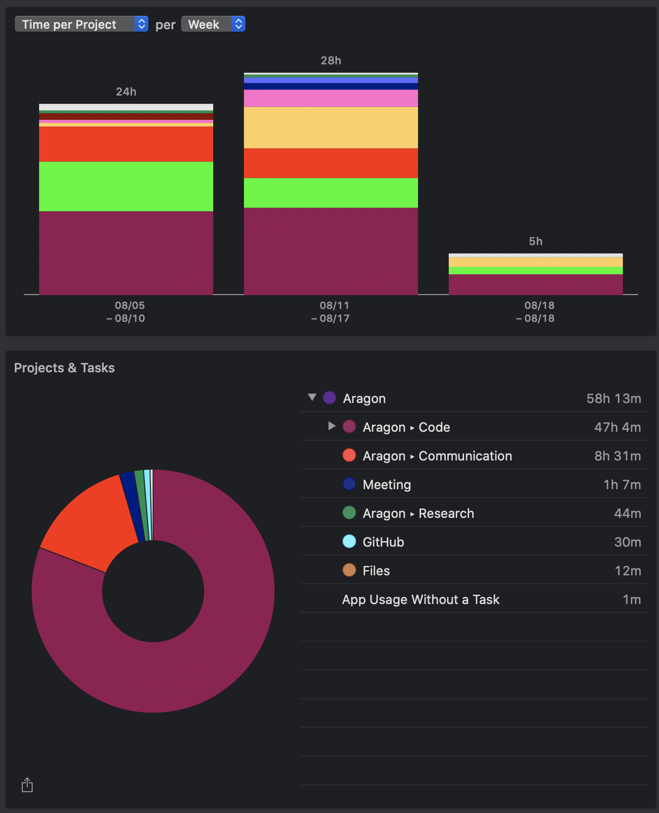

# Milestone 19

|       |                  |
| ----- | ---------------- |
| From  | 2019-08-05       |
| Until | 2019-08-19       |
| Hours | 55.60            |
| Asked | 2224 DAI @ 40/hr |
| Given | -                |

## References

Tx: <https://etherscan.io/tx/0xb821865c45ad63ece6507c8eb21f4f42731d946099f0ace5918131fdac1553f8>

## Description

### Work in progress

### Opened these PRs

2019-08-18 **dao-templates** [#136 Publish script for aragen && include register-packages option on deployer](https://github.com/aragon/dao-templates/pull/136)

 2019-08-18 **aragon** [#917 Changes to fix aragen automatic deployment](https://github.com/aragon/aragon/pull/917)

 2019-08-18 **aragon-cli** [#720 Release patch version](https://github.com/aragon/aragon-cli/pull/720)

 2019-08-18 **aragon-cli** [#725 Fix snapshot & lint](https://github.com/aragon/aragon-cli/pull/725)

 2019-08-18 **aragen** [#74 Configure initial account balances](https://github.com/aragon/aragen/issues/74)

 2019-08-16 **aragon.js** [#360 Add web3Eth examples](https://github.com/aragon/aragon.js/pull/360)

 2019-08-15 **aragon-cli** [#713 Add Aragon's default endpoint](https://github.com/aragon/aragon-cli/pull/713)

 2019-08-14 **aragon-react-boilerplate** [#72 Update to use Aragon node as default](https://github.com/aragon/aragon-react-boilerplate/pull/72)

 2019-08-14 **aragon-bare-boilerplate** [#23 Update to use Aragon's node as default](https://github.com/aragon/aragon-bare-boilerplate/pull/23)

 2019-08-14 **your-first-aragon-app** [#8 Update to use Aragon node as default](https://github.com/aragon/your-first-aragon-app/pull/8)

 2019-08-13 **dao-templates** [#130 WIP: DAO template engine](https://github.com/aragon/dao-templates/pull/130)

 2019-08-08 **hack** [#183 Fix typo on reference](https://github.com/aragon/hack/pull/183)

 2019-08-08 **aragon-cli** [#701 Fix http publish workflow && improve ipfs handler](https://github.com/aragon/aragon-cli/pull/701)

 2019-08-08 **hack** [#182 Fix aragonAPI links](https://github.com/aragon/hack/pull/182)

 2019-08-07 **aragon-cli** [#697 Update documentation](https://github.com/aragon/aragon-cli/pull/697)

 2019-08-07 **aragon-cli** [#699 Doc: Improve IPFS section](https://github.com/aragon/aragon-cli/pull/699)

 2019-08-06 **aragon-cli** [#686 Update aragen & client](https://github.com/aragon/aragon-cli/pull/686)

 2019-08-06 **aragon-cli** [#687 CLI: avoid coercing number arguments from strings to JS numbers](https://github.com/aragon/aragon-cli/pull/687)

 2019-08-05 **aragon-cli** [#685 Fix prepare publish function and publish intent argument ](https://github.com/aragon/aragon-cli/pull/685)

 2019-08-05 **aragen** [#72 Include default values for task](https://github.com/aragon/aragen/pull/72)

### Tested/reviewed these PRs

2019-08-16 **aragon-desktop** [#79 Fixes #13 and #76](https://github.com/aragon/aragon-desktop/pull/79)

2019-08-15 **aragon-cli** [#707 New Assign Id Command](https://github.com/aragon/aragon-cli/pull/707)

2019-08-13 **aragon-cli** [#709 v7: Extensions refactor](https://github.com/aragon/aragon-cli/pull/709)

 2019-08-07 **aragon-cli** [#385 check for existing transactionPath in execHandler](https://github.com/aragon/aragon-cli/pull/385)

### Opened/discussed these issues

2019-08-16 **aragon-cli** [#719 Update truffle to v5](https://github.com/aragon/aragon-cli/issues/719)

2019-08-07 **aragon-cli** [#691 Clean up execHandler](https://github.com/aragon/aragon-cli/issues/691)

 2019-08-06 **aragon-cli** [#689 Parse arguments into BN.js object](https://github.com/aragon/aragon-cli/issues/689)

## Report

