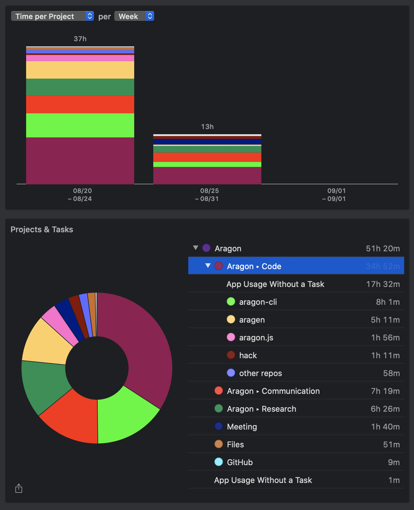

# Milestone 20

|       |                  |
| ----- | ---------------- |
| From  | 2019-08-20       |
| Until | 2019-09-01       |
| Hours | 51.34            |
| Asked | 2567 DAI @ 50/hr |
| Given | -                |

## References

## Description

### Work in progress

### Opened these PRs

 2019-08-19 **aragen** [#73 Update scripts to use new templates and fix automatic releses](https://github.com/aragon/aragen/pull/73)

 2019-08-19 **dao-templates** [#136 Publish script for aragen && include register-packages option on deployer](https://github.com/aragon/dao-templates/pull/136)

 2019-08-18 **dao-templates** [#137 Publish script for aragen && include register-packages option on deployer](https://github.com/aragon/dao-templates/pull/137)

 2019-08-18 **aragon** [#917 Changes to fix aragen automatic deployment](https://github.com/aragon/aragon/pull/917)

 2019-08-18 **aragen** [#73 Update scripts to use new templates and fix automatic releses](https://github.com/aragon/aragen/pull/73)

 2019-08-18 **aragon-cli** [#720 Release patch version](https://github.com/aragon/aragon-cli/pull/720)

 2019-08-18 **aragon-cli** [#724 Fix README.md](https://github.com/aragon/aragon-cli/pull/724)

 2019-08-16 **aragon.js** [#360 Add web3Eth examples](https://github.com/aragon/aragon.js/pull/360)

 2019-08-15 **aragon-cli** [#713 Add Aragon's default endpoint](https://github.com/aragon/aragon-cli/pull/713)

 2019-08-15 **aragon-cli** [#712 Defaults wsRPC value to Aragon client's ws connections](https://github.com/aragon/aragon-cli/issues/712)

 2019-08-14 **aragon-react-boilerplate** [#72 Update to use Aragon node as default](https://github.com/aragon/aragon-react-boilerplate/pull/72)

 2019-08-14 **aragon-bare-boilerplate** [#23 Update to use Aragon's node as default](https://github.com/aragon/aragon-bare-boilerplate/pull/23)

 2019-08-14 **your-first-aragon-app** [#8 Update to use Aragon node as default](https://github.com/aragon/your-first-aragon-app/pull/8)

### Tested/reviewed these PRs

 2019-08-15 **aragon-cli** [#707 New Assign Id Command](https://github.com/aragon/aragon-cli/pull/707)

 2019-08-13 **dao-templates** [#130 WIP: DAO template engine](https://github.com/aragon/dao-templates/pull/130)

 2019-08-16 **aragon-desktop** [#79 Fixes #13 and #76](https://github.com/aragon/aragon-desktop/pull/79)

 2019-08-20 **aragon-react-boilerplate** [#74 Uses aragonOS' truffle.js](https://github.com/aragon/aragon-react-boilerplate/pull/74)

 2019-08-20 **aragon-react-boilerplate** [#73 Adds Truffle dependency so that tests can run](https://github.com/aragon/aragon-react-boilerplate/pull/73)

 2019-08-20 **aragon-react-boilerplate** [#75 Makes tests simpler and easier to understand](https://github.com/aragon/aragon-react-boilerplate/pull/75)

### Opened/discussed these issues

 2019-08-16 **aragon-cli** [#719 Update truffle to v5](https://github.com/aragon/aragon-cli/issues/719)

 2019-08-18 **aragen** [#74 Configure initial account balances](https://github.com/aragon/aragen/issues/74)

## Report

