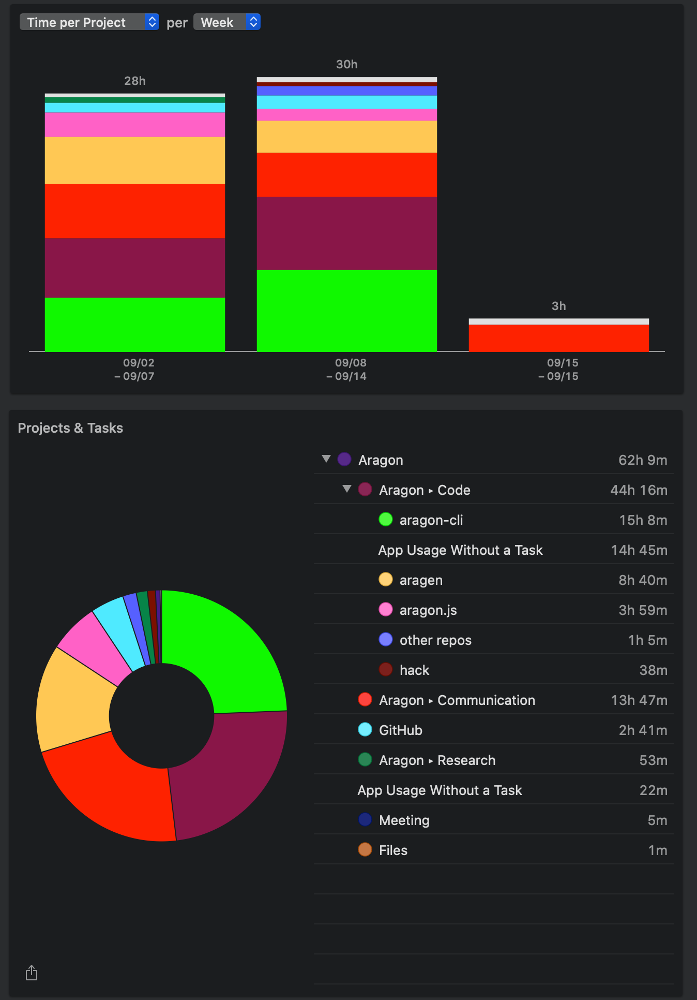

# Milestone 20

|       |                     |
| ----- | ------------------- |
| From  | 2019-09-02          |
| Until | 2019-09-15          |
| Hours | 62.15               |
| Asked | 3107.50 DAI @ 50/hr |
| Given | 3107.50 DAI         |

## References

Tx: <https://etherscan.io/tx/0xe831626a2ec6b10aaa16c61a7310c9d6d0b271d1b5b4706170b9dae2c3a43a95>

## Description

### Work in progress

### Opened these PRs

2019-09-15 **aragon-cli** [#489 Feature to link deployed library contracts](https://github.com/aragon/aragon-cli/pull/489)

2019-09-14 **aragon-react-boilerplate** [#77 Fix event name & remove prepublish script](https://github.com/aragon/aragon-react-boilerplate/pull/77)

2019-09-14 **aragon-bare-boilerplate** [#26 Remove prepublish script](https://github.com/aragon/aragon-bare-boilerplate/pull/26)

2019-09-13 **dao-templates** [#160 Fix typo on bare script](https://github.com/aragon/dao-templates/pull/160)

2019-09-13 **aragen** [#80 Patch release](https://github.com/aragon/aragen/pull/80)

2019-09-13 **aragen** [#81 Patch release](https://github.com/aragon/aragen/pull/81)

2019-09-13 **aragon-cli** [#772 Dao new clean](https://github.com/aragon/aragon-cli/pull/772)

2019-09-12 **aragon-cli** [#764 Use a pre build of the client instead of building it every time](https://github.com/aragon/aragon-cli/pull/764)

2019-09-12 **aragon-cli** [#768 Include templates args](https://github.com/aragon/aragon-cli/pull/768)

2019-09-12 **aragen** [#79 Update ganache && fixes to devchain parametrization](https://github.com/aragon/aragen/pull/79)

2019-09-11 **dao-templates** [#137 Publish script for aragen && include register-packages option on deployer](https://github.com/aragon/dao-templates/pull/137)

2019-09-11 **aragon-cli** [#763 Update default ipfs distribution installed](https://github.com/aragon/aragon-cli/pull/763)

2019-09-11 **aragon-cli** [#765 Update client to 0.8](https://github.com/aragon/aragon-cli/pull/765)

2019-09-11 **aragon-cli** [#421 Update signing node to point aragon node && include infura:{network} environments](https://github.com/aragon/aragon-cli/issues/421)

2019-09-11 **aragon-cli** [#766 Use travis only on mater](https://github.com/aragon/aragon-cli/pull/766)

2019-09-11 **aragon-cli** [#762 Fix deployment with new Templates](https://github.com/aragon/aragon-cli/pull/762)

2019-09-11 **aragen** [#79 Update ganache && fixes to devchain parametization](https://github.com/aragon/aragen/pull/79)

2019-09-11 **aragon-cli** [#762 Fix deployment with new Templates](https://github.com/aragon/aragon-cli/pull/762)

2019-09-11 **aragon-cli** [#763 Update default ipfs distribution installed](https://github.com/aragon/aragon-cli/pull/763)

2019-09-05 **aragon.js** [#384 Include hatch.aragonpm.eth native packages](https://github.com/aragon/aragon.js/pull/384)

2019-09-04 **aragen** [#75 Ganache issue with transaction pathing](https://github.com/aragon/aragen/issues/75)

2019-09-04 **aragen** [#76 Deploy hatch.aragonpm.eth registry](https://github.com/aragon/aragen/issues/76)

2019-09-04 **aragen** [#77 Add Fundraising to snapshot](https://github.com/aragon/aragen/issues/77)

2019-09-04 **aragen** [#78 Fix tx pathing && publish fundraising and hatch APM registry](https://github.com/aragon/aragen/pull/78)

2019-09-04 **aragon-cli** [#752 Fix output for aragon run & fix http publish flag](https://github.com/aragon/aragon-cli/pull/752)

2019-09-04 **aragon-cli** [#669 Fix dao new command for new templates](https://github.com/aragon/aragon-cli/pull/669)

2019-09-04 **aragon-cli** [#753 v6.2.6](https://github.com/aragon/aragon-cli/pull/753)

### Tested/reviewed these PRs

2019-09-12 **aragon-cli** [#767 Added CLI Mnenmonic Warning](https://github.com/aragon/aragon-cli/pull/767)

2019-09-11 **aragon-cli** [#759 Added more dependencies](https://github.com/aragon/aragon-cli/pull/759)

2019-09-02 **aragon-cli** [#746 End to end tests fix](https://github.com/aragon/aragon-cli/pull/746)

### Opened/discussed these issues

2019-09-14 **aragon-desktop** [#80 Couldn't start client](https://github.com/aragon/aragon-desktop/issues/80)

2019-09-14 **aragon-cli** [#758 Initialize every Aragon CLI download with it's own seed phrase](https://github.com/aragon/aragon-cli/issues/758)

2019-09-13 **aragon-cli** [#773 Update documentation with last versions changes](https://github.com/aragon/aragon-cli/issues/773)

2019-09-13 **aragon-cli** [#774 Detect if IPFS version is outdated](https://github.com/aragon/aragon-cli/issues/774)

2019-09-11 **aragon-cli** [#675 Update documentation on how to pass arrays with --app-init-args](https://github.com/aragon/aragon-cli/issues/675)

2019-09-11 **aragon-cli** [#506 Fix dao act documentation](https://github.com/aragon/aragon-cli/issues/506)

2019-09-10 **ganache-core** [#468 default_balance_ether option have no effects when creating ganache server](https://github.com/trufflesuite/ganache-core/issues/468)

2019-09-06 **aragon-react-boilerplate** [#76 IPFS error: no link named "index.html"](https://github.com/aragon/aragon-react-boilerplate/issues/76)

2019-09-03 **aragen** [#61 TypeError: Cannot read property 'pop' of undefined](https://github.com/aragon/aragen/issues/61)

2019-09-02 **frame** [#214 Error when executing transaction using aragon provider](https://github.com/floating/frame/issues/214)

## Report

