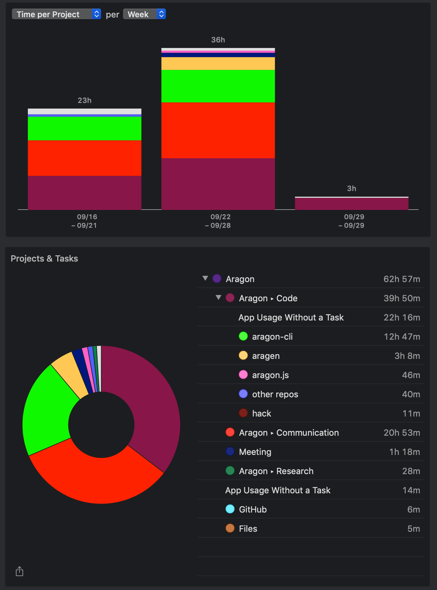

# Milestone 21

|       |                     |
| ----- | ------------------- |
| From  | 2019-09-16          |
| Until | 2019-09-29          |
| Hours | 62.95               |
| Asked | 3147.50 DAI @ 50/hr |
| Given | -                   |

## References

## Description

### Work in progress

2019-09-25 **aragon-cli** [#797 Clean dependencies](https://github.com/aragon/aragon-cli/pull/797)

### Opened these PRs

2019-09-28 **aragon-cli** [#805 V6.3.3](https://github.com/aragon/aragon-cli/pull/805)

2019-09-26 **dao-templates** [#164 Add truffle to the publish files](https://github.com/aragon/dao-templates/pull/164)

2019-09-25 **contract-helpers** [#1 First commit](https://github.com/aragon/contract-helpers/pull/1)

2019-09-24 **aragon-cli** [#793 Generate shrinkwrap files and snapshots](https://github.com/aragon/aragon-cli/pull/793)

2019-09-24 **aragen** [#86 Agent ui](https://github.com/aragon/aragen/pull/86)

2019-09-24 **aragon-react-boilerplate** [#78 Add staging and ropsten](https://github.com/aragon/aragon-react-boilerplate/pull/78)

2019-09-23 **aragon-cli** [#786 Update documentation](https://github.com/aragon/aragon-cli/pull/786)

2019-09-23 **aragen** [#84 Fix automatic deployment](https://github.com/aragon/aragen/pull/84)

2019-09-23 **aragon-cli** [#779 Next clean](https://github.com/aragon/aragon-cli/pull/779)

2019-09-23 **aragen** [#85 Fix automatic releases](https://github.com/aragon/aragen/pull/85)

2019-09-20 **aragon-react-boilerplate** [#81 Go back to DeployInstance event](https://github.com/aragon/aragon-react-boilerplate/pull/81)

2019-09-20 **aragon** [#1090 Add Dandelion icons](https://github.com/aragon/aragon/pull/1090)

2019-09-20 **aragon-cli** [#784 Add deploy event compatibility](https://github.com/aragon/aragon-cli/pull/784)

2019-09-19 **aragon-react-boilerplate** [#80 Add ganache-cli dependency](https://github.com/aragon/aragon-react-boilerplate/pull/80)

2019-09-19 **aragon-bare-boilerplate** [#28 Add ganache-cli dependencies](https://github.com/aragon/aragon-bare-boilerplate/pull/28)

2019-09-18 **aragon-cli** [#398 Better environment names for the boilerplates or the default ones](https://github.com/aragon/aragon-cli/issues/398)

2019-09-18 **deployments** [#54 Deploy `open.aragonpm.eth` to staging](https://github.com/aragon/deployments/issues/54)

2019-09-18 **aragon-react-boilerplate** [#78 Add staging and ropsten](https://github.com/aragon/aragon-react-boilerplate/pull/78)

2019-09-18 **aragon-bare-boilerplate** [#27 Add staging and ropsten](https://github.com/aragon/aragon-bare-boilerplate/pull/27)

2019-09-18 **aragon-cli** [#770 CLI installation and setup confusion](https://github.com/aragon/aragon-cli/issues/770)

2019-09-18 **aragon-cli** [#779 Next clean](https://github.com/aragon/aragon-cli/pull/779)

2019-09-18 **aragon-apps** [#1003 Remove abi folder from npm package](https://github.com/aragon/aragon-apps/issues/1003)

2019-09-16 **aragon-cli** [#778 Backward compatibility fix](https://github.com/aragon/aragon-cli/pull/778)

### Tested/reviewed these PRs

2019-09-27 **aragon-cli** [#489 Feature to link deployed library contracts](https://github.com/aragon/aragon-cli/pull/489)

2019-09-26 **aragon-cli** [#801 Http server check](https://github.com/aragon/aragon-cli/pull/801)

2019-09-25 **aragon-cli** [#796 Update wrapper to rc.17](https://github.com/aragon/aragon-cli/pull/796)

2019-09-23 **aragon-cli** [#785 Fix array arguments support](https://github.com/aragon/aragon-cli/pull/785)

2019-09-23 **aragon-cli** [#767 Added CLI Mnenmonic Warning](https://github.com/aragon/aragon-cli/pull/767)

2019-09-23 **aragon-cli** [#792 Client repo && changelog](https://github.com/aragon/aragon-cli/pull/792)

2019-09-23 **aragon-cli** [#781 aragon-run: Add option for --client-repo](https://github.com/aragon/aragon-cli/pull/781)

### Opened/discussed these issues

2019-09-27 **aragon-cli** [#803 Gs price used when publishing transaction is not the same as the variable passed to --gas-price ](https://github.com/aragon/aragon-cli/issues/803)

2019-09-26 **dao-templates** [#165 Update truffle.js of `template-shared`](https://github.com/aragon/dao-templates/issues/165)

2019-09-25 **contract-helpers** [#3 Decide packages names](https://github.com/aragon/contract-helpers/issues/3)

2019-09-25 **contract-helpers** [#4 Add a repo with AragonOS, AragonID abis](https://github.com/aragon/contract-helpers/issues/4)

2019-09-24 **aragon-cli** [#355 Avoid using ~/.aragon, use XDG Base Directory Specification instead](https://github.com/aragon/aragon-cli/issues/355)

2019-09-23 **aragon-cli** [#758 Initialize every Aragon CLI download with it's own seed phrase](https://github.com/aragon/aragon-cli/issues/758)

2019-09-19 **aragon-cli** [#780 We want to support cyclic dependencies on artifact generation?](https://github.com/aragon/aragon-cli/issues/780)

2019-09-19 **aragon-react-boilerplate** [#79 Fix tests](https://github.com/aragon/aragon-react-boilerplate/issues/79)

2019-09-18 **aragon-react-boilerplate** [#76 IPFS error: no link named "index.html"](https://github.com/aragon/aragon-react-boilerplate/issues/76)

2019-09-18 **aragon-desktop** [#81 Update IPFS to v0.4.22](https://github.com/aragon/aragon-desktop/issues/81)

2019-09-18 **aragon-desktop** [#80 Couldn't start client](https://github.com/aragon/aragon-desktop/issues/80)

## Report

