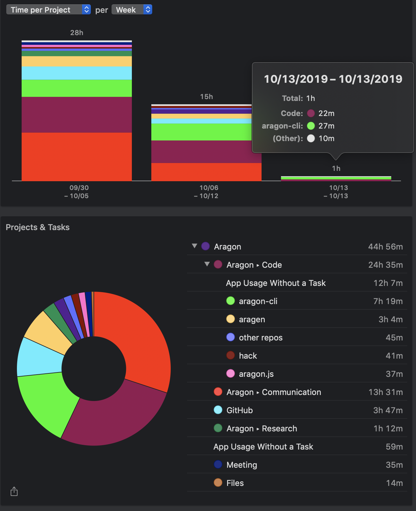

# Milestone 23

|       |                     |
| ----- | ------------------- |
| From  | 2019-09-30          |
| Until | 2019-10-13          |
| Hours | 44.93               |
| Asked | 2246.50 DAI @ 50/hr |
| Given | -                   |

## References

## Description

### Work in progress

### Opened these PRs

2019-10-13 **aragon-cli** [#816 Clean dependencies ](https://github.com/aragon/aragon-cli/pull/816)

2019-10-12 **aragen** [#87 Rollback verbose alias](https://github.com/aragon/aragen/pull/87)

2019-10-09 **aragon-react-boilerplate** [#78 Add staging and ropsten](https://github.com/aragon/aragon-react-boilerplate/pull/78)

2019-10-09 **aragen** [#79 Update ganache && fixes to devchain parametrization](https://github.com/aragon/aragen/pull/79)

2019-10-09 **aragen** [#84 Fix automatic deployment](https://github.com/aragon/aragen/pull/84)

2019-10-08 **aragonOS** [#559 Use Aragon node](https://github.com/aragon/aragonOS/pull/559)

2019-10-01 **dao-templates** [#166 Chore: aragen script cosmetic](https://github.com/aragon/dao-templates/pull/166)

### Tested/reviewed these PRs

2019-10-09 **aragon-cli** [#807 Support ACL permissions with parameters](https://github.com/aragon/aragon-cli/pull/807)

2019-10-02 **aragon-react-boilerplate** [#82 Update to AragonApi v2](https://github.com/aragon/aragon-react-boilerplate/pull/82)

### Opened/discussed these issues

2019-10-09 **aragon-templates-boilerplate** [#1 Smoothest way to install multiple apps](https://github.com/aragon/aragon-templates-boilerplate/issues/1)

2019-10-11 **aragon-cli** [#627 devchain refactor](https://github.com/aragon/aragon-cli/issues/627)

2019-10-09 **aragen** [#74 Configure initial account balances](https://github.com/aragon/aragen/issues/74)

2019-10-09 **aragon-cli** [#814 Update parameters syntax](https://github.com/aragon/aragon-cli/issues/814)

2019-10-03 **aragon-cli** [#327 Create new package for apm commands in monorepo structure](https://github.com/aragon/aragon-cli/issues/327)

2019-10-03 **aragon-cli** [#326 Create new package for dao commands in monorepo structure](https://github.com/aragon/aragon-cli/issues/326)

2019-10-03 **aragon-cli** [#319 Monorepo structure](https://github.com/aragon/aragon-cli/issues/319)

2019-10-03 **contract-helpers** [#4 Add a repo with AragonOS, AragonID abis](https://github.com/aragon/contract-helpers/issues/4)

2019-10-01 **aragon.js** [#393 Docs: Move from AragonApp -&gt; Aragon](https://github.com/aragon/aragon.js/issues/393)

## Report

