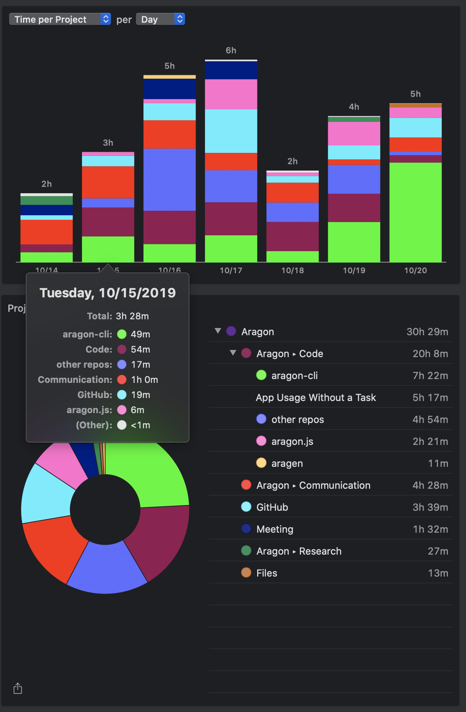

# Milestone 24

|       |                  |
| ----- | ---------------- |
| From  | 2019-10-14       |
| Until | 2019-10-20       |
| Hours | 30.48            |
| Asked | 1524 DAI @ 50/hr |
| Given | -                |

## References

## Description

### Work in progress

### Opened these PRs

2019-10-20 **aragon-cli** [#821 Add node 12 to CI](https://github.com/aragon/aragon-cli/pull/821)

2019-10-20 **aragon-react-boilerplate** [#69 Update contracts and dependencies to use new Templates](https://github.com/aragon/aragon-react-boilerplate/pull/69)

2019-10-20 **aragonOS** [#559 Use Aragon truffle file](https://github.com/aragon/aragonOS/pull/559)

2019-10-20 **aragon-bare-boilerplate** [#27 Add staging](https://github.com/aragon/aragon-bare-boilerplate/pull/27)

2019-10-19 **contract-helpers** [#9 Truffle release](https://github.com/aragon/contract-helpers/pull/9)

2019-10-19 **contract-helpers** [#10 Truffle release](https://github.com/aragon/contract-helpers/pull/10)

2019-10-17 **contract-helpers** [#1 First commit](https://github.com/aragon/contract-helpers/pull/1)

2019-10-17 **contract-helpers** [#2 Beta version of truffle package configure to work with truffle v5](https://github.com/aragon/contract-helpers/issues/2)

2019-10-15 **contract-helpers** [#5 Changes before release](https://github.com/aragon/contract-helpers/pull/5)

### Tested/reviewed these PRs

### Opened/discussed these issues

2019-10-20 **aragon-react-boilerplate** [#84 Add gas reporter tool ⛽️](https://github.com/aragon/aragon-react-boilerplate/issues/84)

2019-10-20 **aragon-react-boilerplate** [#85 Add smart contracts security tool ](https://github.com/aragon/aragon-react-boilerplate/issues/85)

2019-10-20 **aragon-cli** [#421 Include infura:{network} environments](https://github.com/aragon/aragon-cli/issues/421)

2019-10-20 **aragon-cli** [#825 New tool to improve arapp.json customization](https://github.com/aragon/aragon-cli/issues/825)

2019-10-20 **aragon-cli** [#97 aragon contracts test doesn't seem to be erroring or displaying test results properly](https://github.com/aragon/aragon-cli/issues/97)

2019-10-18 **contract-helpers** [#3 Decide packages names](https://github.com/aragon/contract-helpers/issues/3)

2019-10-18 **contract-helpers** [#6 Move minime token to its own repo](https://github.com/aragon/contract-helpers/issues/6)

2019-10-18 **contract-helpers** [#7 Remove apps-shared-scripts](https://github.com/aragon/contract-helpers/issues/7)

2019-10-18 **contract-helpers** [#8 Add deployment helpers from aragonOS](https://github.com/aragon/contract-helpers/issues/8)

2019-10-16 **aragon-cli** [#461 Support node v12](https://github.com/aragon/aragon-cli/issues/461)

2019-10-15 **aragon-cli** [#441 Move off of deprecated @aragon/messenger](https://github.com/aragon/aragon-cli/issues/441)

## Report

