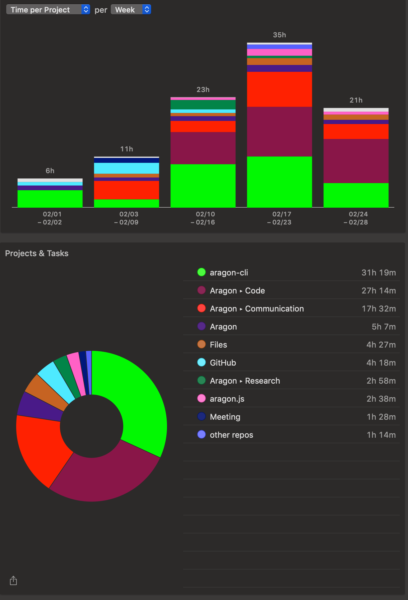

# Milestone 9

|       |                    |
| ----- | ------------------ |
| From  | 2019-02-01         |
| Until | 2019-02-28         |
| Hours | 98.37              |
| Asked | 4918.5 DAI @ 50/hr |
| Given | 4918.5 DAI         |

## References

Tx: <https://etherscan.io/tx/0x2e1adcbc3da9dc7c31175be65ad4854777acd28f3551c132a90faa23d83f1067>

## Description

Opened these PRs:

- [#363 Testing: sharness environment](https://github.com/aragon/aragon-cli/pull/363)
- [#360 Create Roadmap](https://github.com/aragon/aragon-cli/pull/360)
- [#371 aragon init prepare template for environments](https://github.com/aragon/aragon-cli/pull/371)

Tested/reviewed these PRs:

- [#356 Implement `dao act` command for Agent app integration](https://github.com/aragon/aragon-cli/pull/356)
- [#366 Fix gas on grant and publish](https://github.com/aragon/aragon-cli/pull/366)
- [#361 Fix gasLimit issue for dao new](https://github.com/aragon/aragon-cli/pull/361)

Opened/discussed these issues:

- [#378 Nonce too low issue](https://github.com/aragon/aragon-cli/issues/378)
- [#358 E2E tests with sharness](https://github.com/aragon/aragon-cli/issues/358)
- [#77 Add windows-build-tools note for Windows users](https://github.com/aragon/hack/issues/77)

Also worked on a [Roadmap for the CLI](https://github.com/aragon/aragon-cli/pull/360) with Daniel and help people in #dev-help channel.

