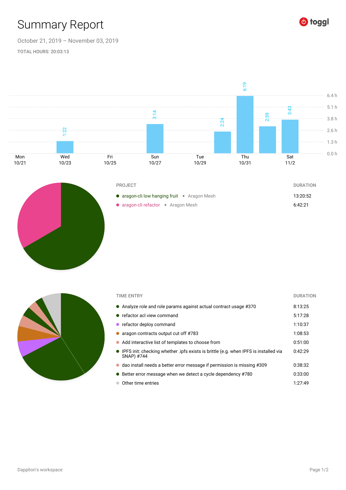

# Milestone 1

|       |                    |
| ----- | ------------------ |
| From  | 2019-10-21         |
| Until | 2019-11-03         |
| Hours | 20.05              |
| Asked | 701.75 DAI @ 35/hr |
| Given | 701.75 DAI         |

## References

Tx: <https://etherscan.io/tx/0xcd8af53dace1eb33ce0999eba501f2c33a95273f3d2c6016a607772f9c0cef87>

## Description

### Work in progress

2019-11-04 **aragon-cli** [#864 Refactor dao acl view - #858 task](https://github.com/aragon/aragon-cli/pull/864)

2019-11-02 **aragon-cli** [#865 Refactor deploy - #858 task](https://github.com/aragon/aragon-cli/pull/865)

### Opened these PRs

2019-11-02 **aragon-cli** [#842 Check if user can do aragon dao install, to resolve #309](https://github.com/aragon/aragon-cli/pull/842)

2019-11-01 **aragon-cli** [#863 Compare contract roles and parameter count with arapp.json, resolves #370](https://github.com/aragon/aragon-cli/pull/863)

2019-10-30 **aragon-cli** [#843 Error if 'aragon run' is executed with a non local environment, to resolve #308](https://github.com/aragon/aragon-cli/pull/843)

2019-10-30 **aragon-cli** [#844 Show a detailed error with next steps when cyclic dependencies are found, to resolve #780](https://github.com/aragon/aragon-cli/pull/844)

2019-10-30 **aragon-cli** [#845 Detect if IPFS is initialized in a more robust way, to resolve #744](https://github.com/aragon/aragon-cli/pull/845)

### Tested/reviewed these PRs

### Opened/discussed these issues

## Report

