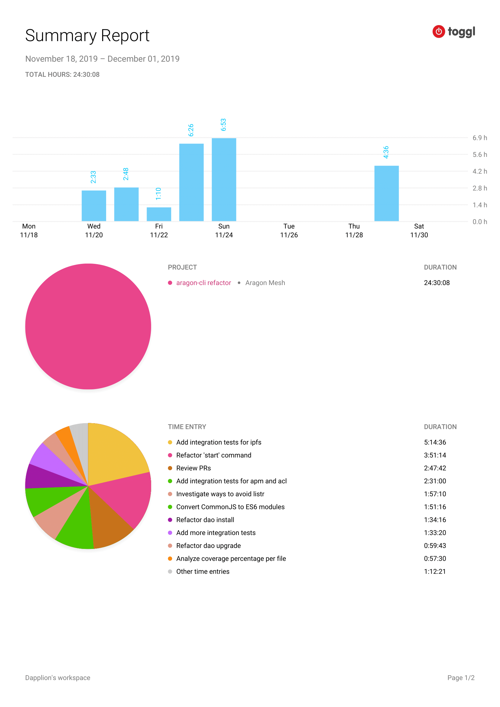

# Milestone 3

|       |                    |
| ----- | ------------------ |
| From  | 2019-11-18         |
| Until | 2019-12-01         |
| Hours | 24.50              |
| Asked | 857.50 DAI @ 35/hr |
| Given | 857.50 DAI         |

## References

Tx: <https://etherscan.io/tx/0xcb554fcf2a1d1db1f279ce58bb39ed4655471be6997292abcfeb007b8e1d8962>

## Description

Keep pushing towards completing the first iteration of the aragonCLI refactor

### Work in progress

### Opened these PRs

2019-11-29 **aragon-cli** [#973 Use native multi-line template literals](https://github.com/aragon/aragon-cli/pull/973)

2019-11-29 **aragon-cli** [#974 Extract logic from 'start' command](https://github.com/aragon/aragon-cli/pull/974)

2019-11-26 **aragon-cli** [#952 Add more integration tests](https://github.com/aragon/aragon-cli/pull/952)

2019-11-23 **aragon-cli** [#950 WIP Syntax changes to boost code coverage](https://github.com/aragon/aragon-cli/pull/950)

2019-11-23 **aragon-cli** [#2 Convert CommonJS to ES6 modules](https://github.com/dapplion/aragon-cli/pull/2)

2019-11-20 **aragon-cli** [#942 Extract logic from dao install command](https://github.com/aragon/aragon-cli/pull/942)

2019-11-20 **aragon-cli** [#943 Extract logic from dao upgrade command](https://github.com/aragon/aragon-cli/pull/943)

### Tested/reviewed these PRs

2019-12-02 **aragon-cli** [#951 Fix ipfs start detached flag](https://github.com/aragon/aragon-cli/pull/951)

2019-11-29 **aragon-cli** [#955 Extract logic from "dao apps" and "dao new"](https://github.com/aragon/aragon-cli/pull/955)

2019-11-23 **aragon-cli** [#912 Refactor IPFS commands](https://github.com/aragon/aragon-cli/pull/912)

2019-11-21 **aragon-cli** [#902 Extracts logic from apm commands: grant command](https://github.com/aragon/aragon-cli/pull/902)

### Opened/discussed these issues

2019-11-24 **aragon-cli** [#953 Consider dropping tiny dependencies](https://github.com/aragon/aragon-cli/issues/953)

2019-11-21 **aragon-cli** [#948 Don't use process.exit()](https://github.com/aragon/aragon-cli/issues/948)

## Report

====
