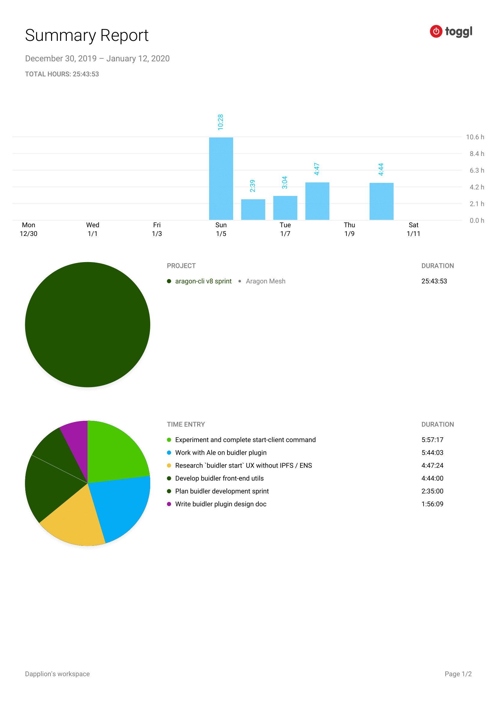

# Milestone 4

|       |                    |
| ----- | ------------------ |
| From  | 2019-12-30         |
| Until | 2020-01-12         |
| Hours | 25.71              |
| Asked | 1285,5 DAI @ 50/hr |
| Given | -                  |

## References

## Description

Kick start the first sprint working on the Aragon Buidler plugin.

**Note**: The initial work was developed in a different repo [dapplion/buidler-typescript-aragon-poc](https://github.com/dapplion/buidler-typescript-aragon-poc) therefore it does not appear as opened PRs. The code was latter iterated, recycled and commited by @ajsantander in the aragon/aragon-cli repo.

### Work in progress

### Opened these PRs

2020-01-10 **aragon-cli** [#1193 Add front-end utils](https://github.com/aragon/aragon-cli/pull/1193)

2020-01-07 **aragon-cli** [#1179 Read arapp for contract name](https://github.com/aragon/aragon-cli/pull/1179)

2020-01-03 **aragon-cli** [#1105 Run tests without subprocess and split tests and examples](https://github.com/aragon/aragon-cli/pull/1105)

### Tested/reviewed these PRs

### Opened/discussed these issues

2020-01-03 **aragon-cli** [#1114 Ipfs propagate hangs forever fetching the gateways](https://github.com/aragon/aragon-cli/issues/1114)

2020-01-03 **aragon-cli** [#1155 Review IPFS propagation technique](https://github.com/aragon/aragon-cli/issues/1155)

## Report

====
