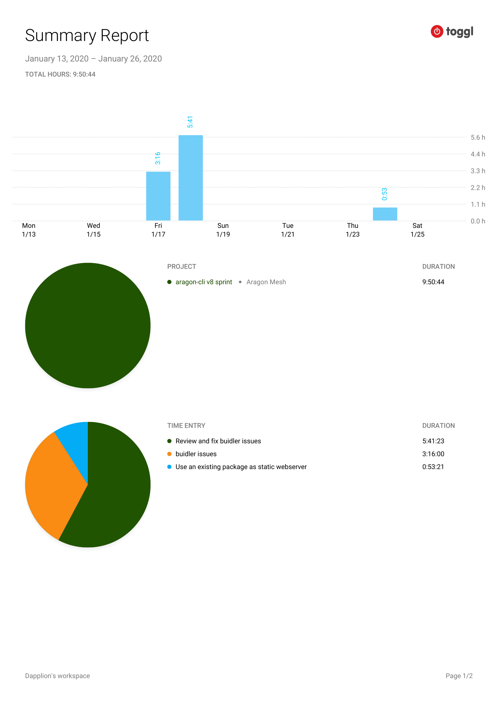

# Milestone 7

|       |                   |
| ----- | ----------------- |
| From  | 2019-01-13        |
| Until | 2020-01-26        |
| Hours | 9.83              |
| Asked | 491.5 DAI @ 50/hr |
| Given | -                 |

## References

## Description

Review and debug and fix the work done on the Aragon Buidler plugin during the first sprint.

### Work in progress

### Opened these PRs

2020-01-23 **buidler-aragon** [#2 Use an existing package as static webserver](https://github.com/aragon/buidler-aragon/pull/2) |

2020-01-23 **aragon-cli** [#1265 Use an existing package as static webserver](https://github.com/aragon/aragon-cli/pull/1265) |

2020-01-21 **aragon-cli** [#1226 Buidler plugin](https://github.com/aragon/aragon-cli/pull/1226) |

### Tested/reviewed these PRs

### Opened/discussed these issues

2020-01-21 **aragon-cli** [#1230 Buidler plugin - artifacts watchers](https://github.com/aragon/aragon-cli/issues/1230) |

2020-01-18 **aragon-cli** [#1216 Bug: Review front end watching.](https://github.com/aragon/aragon-cli/issues/1216) |

## Report

====
