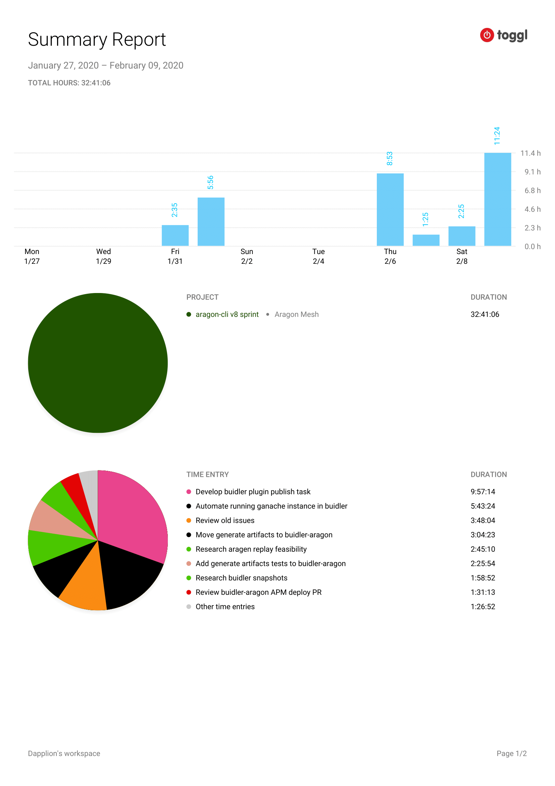

# Milestone 8

|       |                  |
| ----- | ---------------- |
| From  | 2019-01-27       |
| Until | 2020-02-09       |
| Hours | 32.68            |
| Asked | 1634 DAI @ 50/hr |
| Given | -                |

## References

## Description

Progress the Buidler plugin in sprint 2. Focussed on improving the DX of existing task `start` and developed the next task of the development flow `publish`. Also help transition issues related to the buidler plugin codebase from `aragon-cli`.

### Work in progress

2020-02-10 **buidler-aragon** [#14 Bootstrap publish task](https://github.com/aragon/buidler-aragon/pull/14)

2020-02-08 **buidler-aragon** [#12 Test generateArtifacts functions with a basic contract](https://github.com/aragon/buidler-aragon/pull/12)

### Opened these PRs

2020-02-06 **buidler-aragon** [#8 Run ganache-core before deploying bases](https://github.com/aragon/buidler-aragon/pull/8)

2020-02-06 **buidler-aragon** [#9 Reduce ganache gas limit](https://github.com/aragon/buidler-aragon/pull/9)

2020-02-06 **buidler-aragon** [#7 Port generate artifacts functions to buidler repo in Typescript](https://github.com/aragon/buidler-aragon/pull/7)

### Tested/reviewed these PRs

2020-02-09 **buidler-aragon** [#13 Blessed UI](https://github.com/aragon/buidler-aragon/pull/13)

2020-02-06 **buidler-aragon** [#5 Manually deploy bases](https://github.com/aragon/buidler-aragon/pull/5)

### Opened/discussed these issues

2020-02-06 **buidler-aragon** [#6 Dangerous check on app build](https://github.com/aragon/buidler-aragon/issues/6)

2020-02-01 **aragon-cli** [#139 Client doesn't re-download if initial download attempt times out](https://github.com/aragon/aragon-cli/issues/139)

2020-02-01 **aragon-cli** [#744 IPFS init: checking whether .ipfs exists is brittle](https://github.com/aragon/aragon-cli/issues/744)

2020-02-01 **aragon-cli** [#845 Detect if IPFS is initialized in a more robust way, to resolve #744](https://github.com/aragon/aragon-cli/pull/845)

2020-01-31 **aragon-cli** [#573 Limit deploying to http only if on a localhost server](https://github.com/aragon/aragon-cli/issues/573)

2020-01-31 **aragon-cli** [#308 aragon run add error messaging if you try to use a network other than local rpc](https://github.com/aragon/aragon-cli/issues/308)

## Report

====
