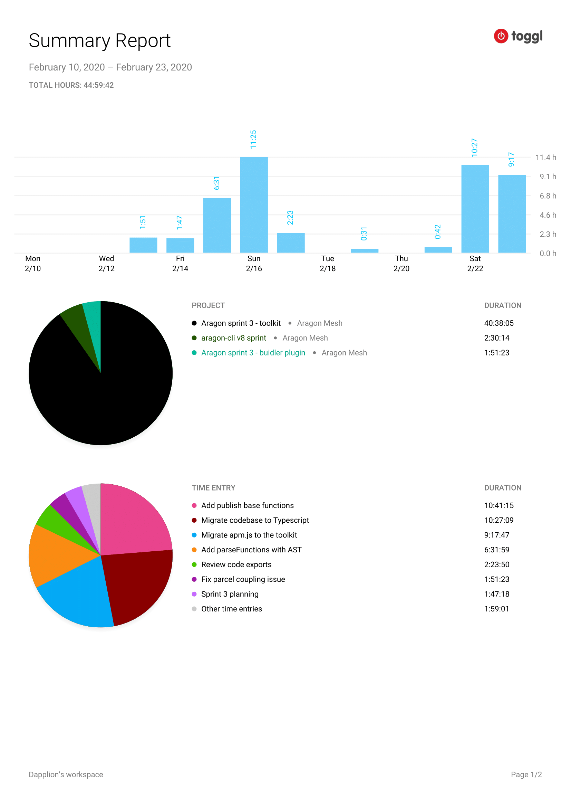

# Milestone 9

|       |                  |
| ----- | ---------------- |
| From  | 2019-02-10       |
| Until | 2020-02-23       |
| Hours | 44.98            |
| Asked | 2249 DAI @ 50/hr |
| Given | -                |

## References

## Description

Shifted efforts to the toolkit. Started executing the vision of how publish should be handled that was agreed on various meetings and async discussions. Also worked on migrating codebases to Typescript and using better APIs and dependencies.

### Work in progress

2020-02-23 **aragon-cli** [#1503 Refactor APM API and clients](https://github.com/aragon/aragon-cli/pull/1503)

2020-02-22 **aragon-cli** [#1501 WIP Migrate toolkit codebase to Typescript](https://github.com/aragon/aragon-cli/pull/1501)

### Opened these PRs

2020-02-19 **aragon-cli** [#1494 WIP: Publish in toolkit](https://github.com/aragon/aragon-cli/pull/1494)

2020-02-19 **aragon-cli** [#1465 Challenge: makes this work with the current setup](https://github.com/aragon/aragon-cli/pull/1465)

2020-02-19 **aragon-cli** [#1492 Add ts-node to support types in tests](https://github.com/aragon/aragon-cli/pull/1492)

2020-02-17 **aragon-cli** [#1468 Activate eslint rule no-anonymous-default-export](https://github.com/aragon/aragon-cli/pull/1468)

2020-02-14 **buidler-aragon** [#19 Better detect when the npm script serve is ready](https://github.com/aragon/buidler-aragon/pull/19)

2020-02-10 **buidler-aragon** [#14 Bootstrap publish task](https://github.com/aragon/buidler-aragon/pull/14)

### Tested/reviewed these PRs

2020-02-18 **buidler-aragon** [#21 Reorganize all source files](https://github.com/aragon/buidler-aragon/pull/21)

2020-02-10 **buidler-aragon** [#13 Blessed UI](https://github.com/aragon/buidler-aragon/pull/13)

### Opened/discussed these issues

2020-02-22 **web3.js** [#3386 Typescript compilation error regarding a bignumber.js import](https://github.com/ethereum/web3.js/issues/3386)

2020-02-17 **aragon-cli** [#1467 Assumed artifact path is not global among tools](https://github.com/aragon/aragon-cli/issues/1467)

2020-02-15 **aragon-cli** [#1435 IPFS logic should not live on the toolkit](https://github.com/aragon/aragon-cli/issues/1435)

2020-02-15 **aragon-cli** [#948 Don't use process.exit()](https://github.com/aragon/aragon-cli/issues/948)

2020-02-14 **aragon-cli** [#1454 Avoid unnecessary compilations in Buidler plugin?](https://github.com/aragon/aragon-cli/issues/1454)

2020-02-14 **buidler-aragon** [#6 Dangerous check on app build](https://github.com/aragon/buidler-aragon/issues/6)

2020-02-14 **aragon-cli** [#1452 Toolkit: Segmented exports](https://github.com/aragon/aragon-cli/issues/1452)

## Report

====
